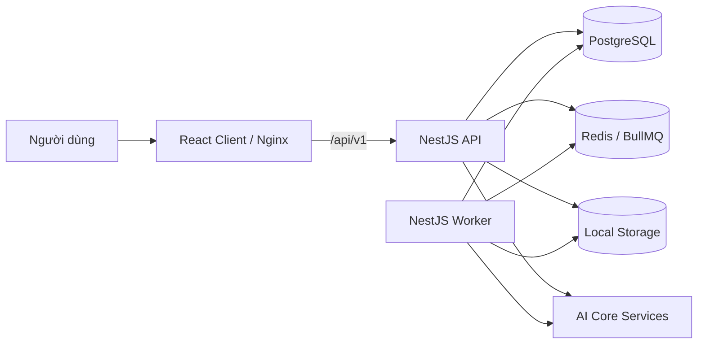

# Hệ thống Định danh Giọng nói

Hệ thống hỗ trợ đăng ký, quản lý và định danh giọng nói. Dự án còn cung cấp xử lý audio, Speech-to-Text, OCR, dịch, tóm tắt và quản lý lịch sử.

Repository được tổ chức theo mô hình monorepo, gồm React Client, NestJS API và worker xử lý tác vụ nền.

## Chức năng chính

- Đăng nhập, refresh token, đăng xuất và đổi mật khẩu.
- Quản lý tài khoản `ADMIN` và `OPERATOR`.
- Upload và kiểm tra file audio.
- Đăng ký hồ sơ giọng nói.
- Định danh một hoặc nhiều người nói.
- Quản lý hồ sơ và lịch sử cập nhật giọng nói.
- Xem phiên định danh và phát audio theo speaker.
- Chuyển dữ liệu AI gợi ý thành hồ sơ chính thức.
- Chuẩn hóa audio, lọc nhiễu và Speech-to-Text.
- OCR, dịch, tóm tắt, xuất file và lịch sử dịch.

## Kiến trúc tổng quan



Các thành phần:

- `apps/client`: giao diện React/Vite.
- `apps/api`: API NestJS và worker.
- PostgreSQL: dữ liệu nghiệp vụ.
- Redis/BullMQ: queue và trạng thái job tạm.
- Local Storage: audio và file xử lý.
- AI Core: identify, OCR, Speech-to-Text, lọc nhiễu và dịch.

Chi tiết xem [Kiến trúc hệ thống](./docs/architecture/system-architecture.md).

## Công nghệ

| Thành phần | Công nghệ                         |
| ---------- | --------------------------------- |
| Monorepo   | pnpm workspace, Turborepo         |
| Backend    | Node.js 20, NestJS 11, TypeScript |
| Frontend   | React 19, Vite 8, TypeScript      |
| Database   | PostgreSQL 15, Prisma 7           |
| Queue      | Redis, BullMQ                     |
| API docs   | Swagger/OpenAPI                   |
| Logging    | Winston                           |
| Kiểm thử   | Jest, Supertest                   |
| Triển khai | Docker, Docker Compose, Nginx     |

## Bắt đầu nhanh

### Yêu cầu

- Node.js 20 trở lên.
- pnpm 9.15.4 hoặc tương thích.
- Docker Engine và Docker Compose v2.
- Git.

Xem đầy đủ tại [Yêu cầu hệ thống](./docs/technical/system-requirements.md).

### Cài đặt

```bash
pnpm install
cp .env.example .env.development
pnpm infra:up
pnpm prisma:generate
pnpm prisma:migrate
```

### Chạy ứng dụng

API và frontend:

```bash
pnpm dev
```

Worker:

```bash
pnpm dev:worker
```

Worker phải chạy khi sử dụng job BullMQ.

Hướng dẫn đầy đủ:

- [Cài đặt môi trường](./docs/setup/environment-setup.md).
- [Build và chạy dự án](./docs/setup/build-and-run.md).

## Địa chỉ development

| Thành phần  | Địa chỉ mặc định                 |
| ----------- | -------------------------------- |
| Frontend    | `http://localhost:5173`          |
| Backend     | `http://localhost:3000`          |
| API prefix  | `http://localhost:3000/api/v1`   |
| Swagger     | `http://localhost:3000/api-docs` |
| Module docs | `http://localhost:3000/docs`     |
| PostgreSQL  | `localhost:5442`                 |
| Redis       | `localhost:6382`                 |

Port thực tế có thể thay đổi qua `.env.development`.

## Lệnh thường dùng

| Mục đích             | Lệnh                 |
| -------------------- | -------------------- |
| Chạy API và frontend | `pnpm dev`           |
| Chạy API             | `pnpm dev:api`       |
| Chạy frontend        | `pnpm dev:client`    |
| Chạy worker          | `pnpm dev:worker`    |
| Build                | `pnpm build`         |
| Lint                 | `pnpm lint`          |
| Kiểm tra type        | `pnpm check-types`   |
| Test backend         | `pnpm test:api`      |
| Prisma Studio        | `pnpm prisma:studio` |
| Xem log Docker       | `pnpm infra:logs`    |

## Tài liệu kỹ thuật

Toàn bộ tài liệu bàn giao được viết bằng Markdown và quản lý cùng mã nguồn.

### Technical

| Tài liệu                                                    | Nội dung                                   |
| ----------------------------------------------------------- | ------------------------------------------ |
| [Yêu cầu hệ thống](./docs/technical/system-requirements.md) | Phần mềm, phần cứng, network và dependency |
| [Cấu trúc dự án](./docs/technical/project-structure.md)     | Trách nhiệm của thư mục và module          |
| [Tổng quan API](./docs/technical/api-overview.md)           | Endpoint, response, xác thực và mã lỗi     |

### Setup

| Tài liệu                                                | Nội dung                         |
| ------------------------------------------------------- | -------------------------------- |
| [Cài đặt môi trường](./docs/setup/environment-setup.md) | Chuẩn bị development             |
| [Build và chạy](./docs/setup/build-and-run.md)          | Lệnh chạy, build, test và Prisma |

### Architecture

| Tài liệu                                                         | Nội dung                              |
| ---------------------------------------------------------------- | ------------------------------------- |
| [Kiến trúc hệ thống](./docs/architecture/system-architecture.md) | Thành phần và kết nối                 |
| [Luồng dữ liệu](./docs/architecture/data-flow.md)                | Auth, upload, enroll, identify và job |
| [ERD](./docs/architecture/erd.md)                                | Bảng, quan hệ, index và quy tắc xóa   |

### Operations

| Tài liệu                                                | Nội dung                         |
| ------------------------------------------------------- | -------------------------------- |
| [Triển khai](./docs/operations/deployment.md)           | Build image và deploy production |
| [Troubleshooting](./docs/operations/troubleshooting.md) | Mã lỗi, tình huống và cách xử lý |

## Database

Nguồn chuẩn của database:

- Schema: `apps/api/prisma/schema.prisma`.
- Migration: `apps/api/prisma/migrations`.
- Seed: `apps/api/prisma/seed.ts`.

Database hiện có chín bảng nghiệp vụ. ERD đầy đủ nằm trong [docs/architecture/erd.md](./docs/architecture/erd.md).

## API

API dùng prefix `/api/v1`. Swagger được tạo từ decorator trong source và có tại `/api-docs` khi backend chạy.

Tài liệu API theo module nằm trong `apps/api/docs` và được phục vụ tại `/docs`.

Khi bàn giao offline, nên xuất thêm OpenAPI JSON/YAML hoặc Postman Collection từ đúng phiên bản backend phát hành.

## Kiểm tra trước khi commit

```bash
pnpm lint
pnpm check-types
pnpm test:api
pnpm build
```

Repository dùng Husky, lint-staged, Prettier, ESLint và Commitlint.

## Triển khai

Luồng production:

1. Tạo `.env.production`.
2. Build và push image.
3. Pull đúng image tag.
4. Backup database.
5. Chạy migration.
6. Khởi động stack.
7. Smoke test và theo dõi log.

Không dùng riêng tag `latest` cho bản bàn giao. Dùng version hoặc commit SHA để truy vết.

Xem [Hướng dẫn triển khai](./docs/operations/deployment.md).

## Bảo mật bàn giao

- Không commit `.env`, token, key hoặc mật khẩu.
- Không bàn giao `node_modules`, log runtime hoặc dữ liệu giọng nói thật.
- Thay toàn bộ secret sau khi bàn giao.
- Không mở Redis ra Internet.
- Chỉ mở PostgreSQL và Prisma Studio trong mạng tin cậy.
- Dùng dữ liệu giả hoặc đã ẩn danh khi demo.

## Trạng thái và giới hạn

- Storage hiện hỗ trợ local driver.
- Hệ thống phụ thuộc vào nhiều AI Core endpoint độc lập.
- Monitoring hoàn chỉnh chưa nằm trong phạm vi bắt buộc.
- Mã lỗi nghiệp vụ hiện còn dùng nhiều mã tổng quát.
- Cần load test trước khi chốt cấu hình phần cứng production.
- Cần chốt retention, backup và restore trước production.

Khi thay đổi kiến trúc, API, database hoặc biến môi trường, phải cập nhật tài liệu liên quan trong cùng pull request.
