# Luồng dữ liệu

Tài liệu mô tả các luồng dữ liệu của Client, API, Worker, PostgreSQL, Redis, Storage và AI Core.

Phạm vi được đối chiếu với toàn bộ controller nghiệp vụ tại thời điểm cập nhật.

## 1. Ký hiệu

| Ký hiệu | Ý nghĩa                       |
| ------- | ----------------------------- |
| Client  | Giao diện React               |
| API     | NestJS backend                |
| Worker  | Update Voice Worker           |
| DB      | PostgreSQL                    |
| Redis   | Queue hoặc trạng thái job tạm |
| Storage | File audio, PDF và file tạm   |
| AI      | AI Core service               |

## 2. Ma trận coverage

| Nhóm        | Endpoint/luồng                          | Phần |
| ----------- | --------------------------------------- | ---- |
| Auth        | Login, refresh token                    | 4    |
| Auth        | Logout, đổi mật khẩu                    | 5    |
| Account     | Xem, sửa, soft-delete tài khoản cá nhân | 6    |
| Admin       | Tạo, tìm kiếm, xem, cập nhật account    | 7    |
| Upload      | Upload audio theo purpose               | 8    |
| Voice       | Enroll                                  | 9    |
| Identify    | Single                                  | 10   |
| Identify    | Multi                                   | 11   |
| Session     | Danh sách, chi tiết, audio speaker      | 12   |
| Voice       | Danh sách, chi tiết, cập nhật thông tin | 13   |
| Voice       | Xóa hồ sơ và xóa AI-only voice          | 14   |
| Voice       | Update embedding bằng BullMQ worker     | 15   |
| Voice       | Lọc nhiễu audio enroll đang active      | 16   |
| AI Voice    | Danh sách, chi tiết, convert            | 17   |
| Audio       | Normalize và filter noise               | 18   |
| OCR/S2T     | Xử lý đồng bộ                           | 19   |
| OCR/S2T     | Job trong API process và polling Redis  | 20   |
| Translation | Dịch, tóm tắt, phát hiện ngôn ngữ       | 21   |
| Translation | Job nền trong API process               | 22   |
| Translation | Export DOCX/PDF                         | 23   |
| Translation | Lịch sử và chỉnh sửa                    | 24   |
| Frontend    | Request, refresh và retry               | 25   |

## 3. Pipeline dùng chung

Mọi endpoint bảo vệ đều đi qua pipeline chung trước khi vào controller.

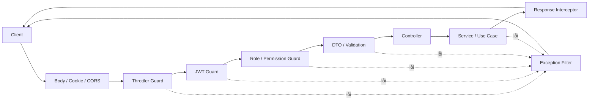
```mermaid
flowchart LR
    Client --> Middleware[Body / Cookie / CORS]
    Middleware --> RateLimit[Throttler Guard]
    RateLimit --> Auth[JWT Guard]
    Auth --> Permission[Role / Permission Guard]
    Permission --> Validation[DTO / Validation]
    Validation --> Controller
    Controller --> UseCase[Service / Use Case]
    UseCase --> Response[Response Interceptor]
    Response --> Client

    RateLimit -. lỗi .-> Filter[Exception Filter]
    Auth -. lỗi .-> Filter
    Permission -. lỗi .-> Filter
    Validation -. lỗi .-> Filter
    UseCase -. lỗi .-> Filter
    Filter --> Client
```

HTTP Logger Interceptor bao quanh handler để gắn request ID, ghi thời gian và trạng thái response.

## 4. Đăng nhập và refresh token

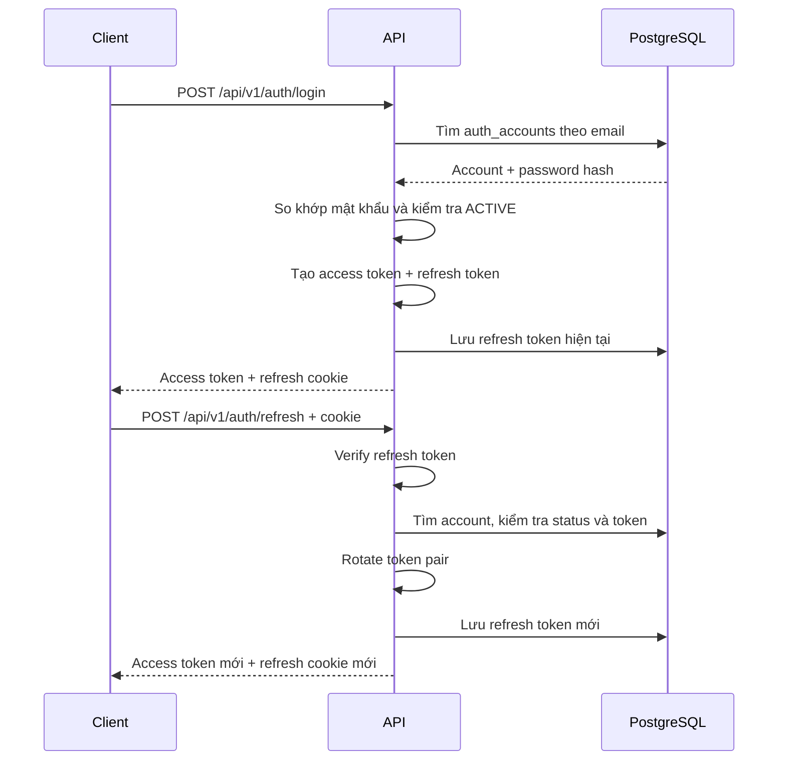
```mermaid
sequenceDiagram
    participant C as Client
    participant A as API
    participant D as PostgreSQL

    C->>A: POST /api/v1/auth/login
    A->>D: Tìm auth_accounts theo email
    D-->>A: Account + password hash
    A->>A: So khớp mật khẩu và kiểm tra ACTIVE
    A->>A: Tạo access token + refresh token
    A->>D: Lưu refresh token hiện tại
    A-->>C: Access token + refresh cookie

    C->>A: POST /api/v1/auth/refresh + cookie
    A->>A: Verify refresh token
    A->>D: Tìm account, kiểm tra status và token
    A->>A: Rotate token pair
    A->>D: Lưu refresh token mới
    A-->>C: Access token mới + refresh cookie mới
```

Access token được frontend lưu trong localStorage và gửi bằng Bearer header.

Refresh token thật nằm trong HTTP-only cookie.

### Lưu ý về implementation

Comment/schema mô tả refresh token được hash, nhưng use-case hiện lưu trực tiếp token và so sánh chuỗi trong `auth_accounts.refresh_token`.

Đây là sai lệch cần được xử lý hoặc cập nhật tài liệu bảo mật trước production.

## 5. Logout và đổi mật khẩu

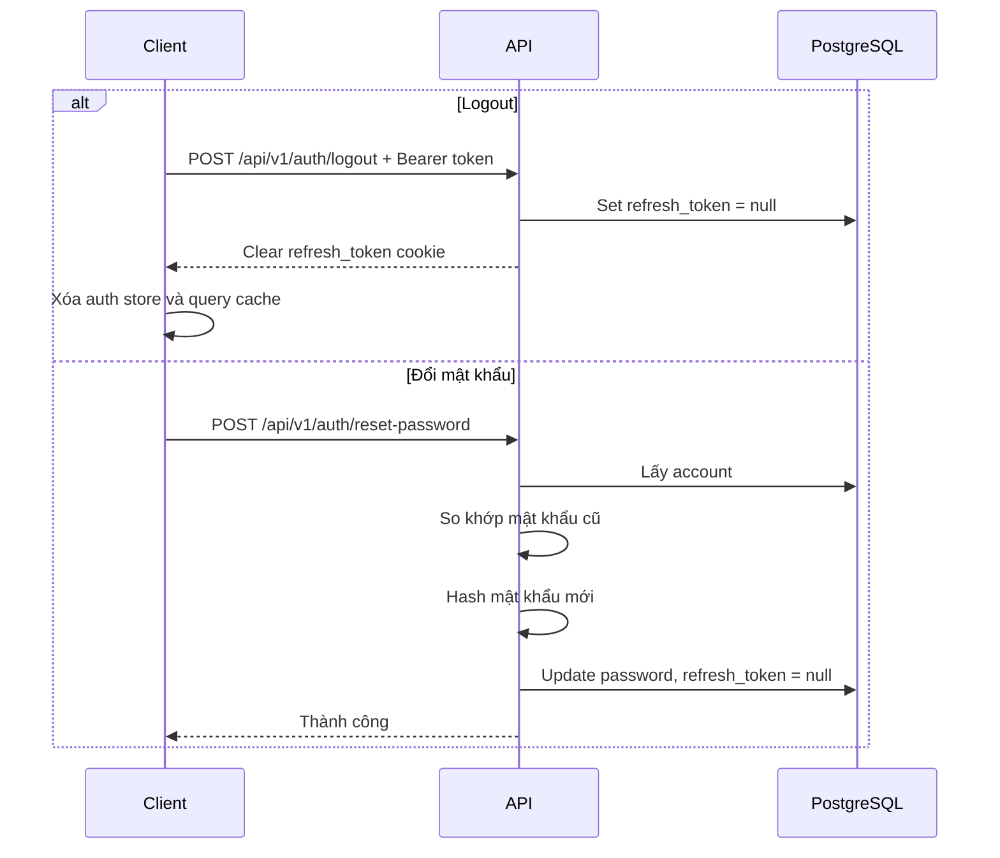
```mermaid
sequenceDiagram
    participant C as Client
    participant A as API
    participant D as PostgreSQL

    alt Logout
        C->>A: POST /api/v1/auth/logout + Bearer token
        A->>D: Set refresh_token = null
        A-->>C: Clear refresh_token cookie
        C->>C: Xóa auth store và query cache
    else Đổi mật khẩu
        C->>A: POST /api/v1/auth/reset-password
        A->>D: Lấy account
        A->>A: So khớp mật khẩu cũ
        A->>A: Hash mật khẩu mới
        A->>D: Update password, refresh_token = null
        A-->>C: Thành công
    end
```

Sau khi đổi mật khẩu, refresh token trong database bị vô hiệu hóa. Client phải đăng nhập lại khi access token hết hạn.

## 6. Tài khoản cá nhân

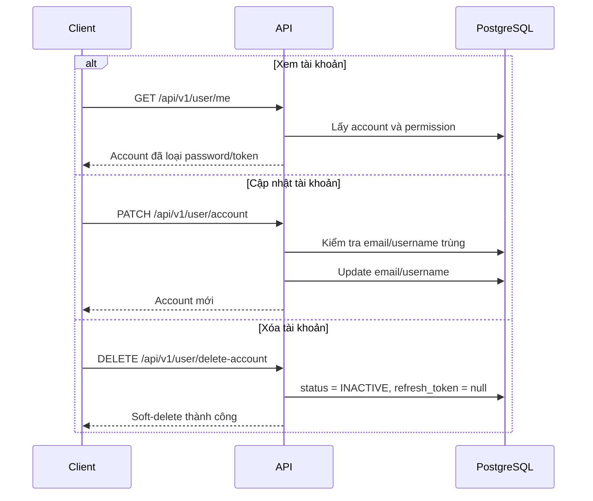
```mermaid
sequenceDiagram
    participant C as Client
    participant A as API
    participant D as PostgreSQL

    alt Xem tài khoản
        C->>A: GET /api/v1/user/me
        A->>D: Lấy account và permission
        A-->>C: Account đã loại password/token
    else Cập nhật tài khoản
        C->>A: PATCH /api/v1/user/account
        A->>D: Kiểm tra email/username trùng
        A->>D: Update email/username
        A-->>C: Account mới
    else Xóa tài khoản
        C->>A: DELETE /api/v1/user/delete-account
        A->>D: status = INACTIVE, refresh_token = null
        A-->>C: Soft-delete thành công
    end
```

Xóa account là soft-delete. Bản ghi và dữ liệu lịch sử vẫn tồn tại.

## 7. Quản trị tài khoản

Chỉ role `ADMIN` được dùng các endpoint `/users/accounts`.

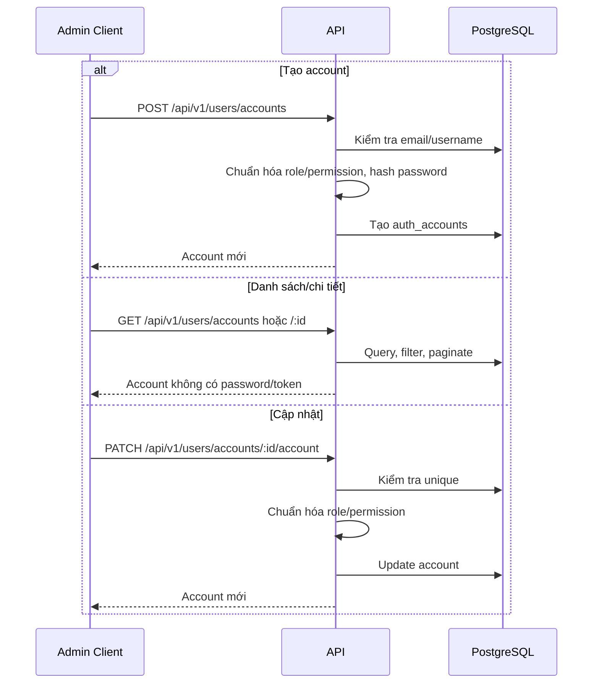
```mermaid
sequenceDiagram
    participant Admin as Admin Client
    participant A as API
    participant D as PostgreSQL

    alt Tạo account
        Admin->>A: POST /api/v1/users/accounts
        A->>D: Kiểm tra email/username
        A->>A: Chuẩn hóa role/permission, hash password
        A->>D: Tạo auth_accounts
        A-->>Admin: Account mới
    else Danh sách/chi tiết
        Admin->>A: GET /api/v1/users/accounts hoặc /:id
        A->>D: Query, filter, paginate
        A-->>Admin: Account không có password/token
    else Cập nhật
        Admin->>A: PATCH /api/v1/users/accounts/:id/account
        A->>D: Kiểm tra unique
        A->>A: Chuẩn hóa role/permission
        A->>D: Update account
        A-->>Admin: Account mới
    end
```

Nếu admin đổi password, refresh token của account bị xóa.

Khi role đổi, permission được tính lại theo role và danh sách permission được gửi lên.

## 8. Upload audio

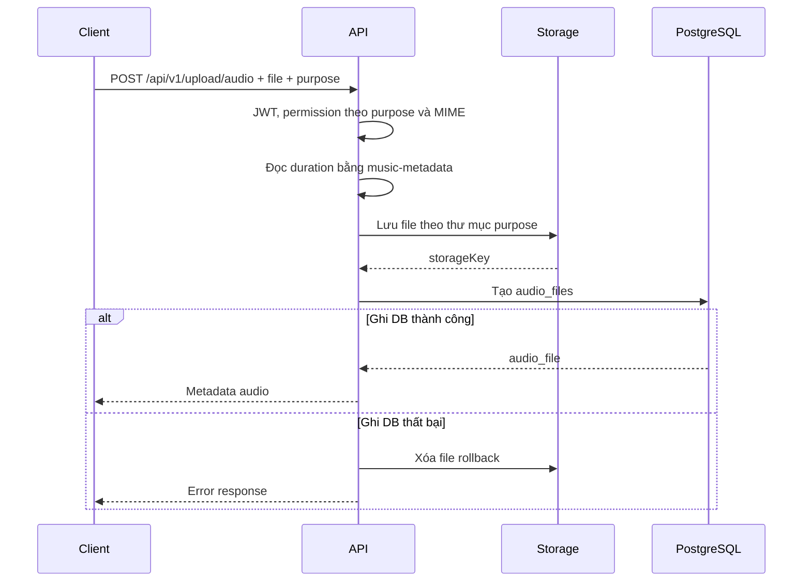
```mermaid
sequenceDiagram
    participant C as Client
    participant A as API
    participant S as Storage
    participant D as PostgreSQL

    C->>A: POST /api/v1/upload/audio + file + purpose
    A->>A: JWT, permission theo purpose và MIME
    A->>A: Đọc duration bằng music-metadata
    A->>S: Lưu file theo thư mục purpose
    S-->>A: storageKey
    A->>D: Tạo audio_files

    alt Ghi DB thành công
        D-->>A: audio_file
        A-->>C: Metadata audio
    else Ghi DB thất bại
        A->>S: Xóa file rollback
        A-->>C: Error response
    end
```

Purpose:

- `ENROLL` lưu dưới `voices`.
- `IDENTIFY` lưu dưới `identify`.
- `UPDATE_VOICE` lưu dưới `update-voice`.

Controller hiện giới hạn tối đa một file cho mỗi request dù service có hàm `uploadMany`.

## 9. Enroll giọng nói

Enroll nhận file trực tiếp trong request. Client không bắt buộc gọi endpoint upload trước.

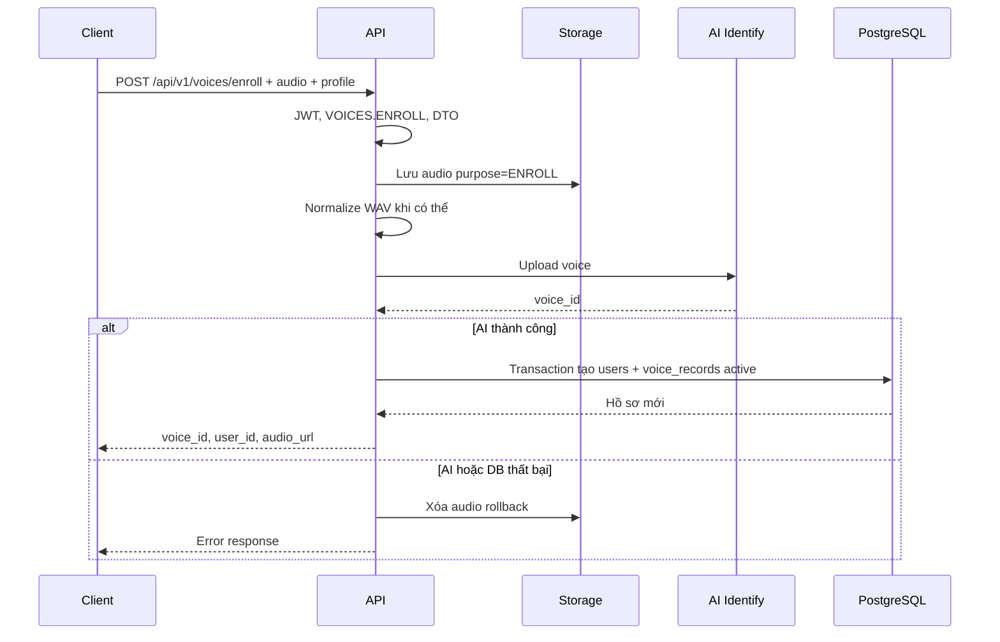
```mermaid
sequenceDiagram
    participant C as Client
    participant A as API
    participant S as Storage
    participant AI as AI Identify
    participant D as PostgreSQL

    C->>A: POST /api/v1/voices/enroll + audio + profile
    A->>A: JWT, VOICES.ENROLL, DTO
    A->>S: Lưu audio purpose=ENROLL
    A->>A: Normalize WAV khi có thể
    A->>AI: Upload voice
    AI-->>A: voice_id

    alt AI thành công
        A->>D: Transaction tạo users + voice_records active
        D-->>A: Hồ sơ mới
        A-->>C: voice_id, user_id, audio_url
    else AI hoặc DB thất bại
        A->>S: Xóa audio rollback
        A-->>C: Error response
    end
```

Nếu normalize timeout, backend gửi file gốc sang AI Core.

Hiện `users.id` được gán bằng `voice_id` AI trả về. AI phải trả UUID hợp lệ để phù hợp schema.

## 10. Identify single

Identify nhận file trực tiếp và lưu file với purpose `IDENTIFY`.

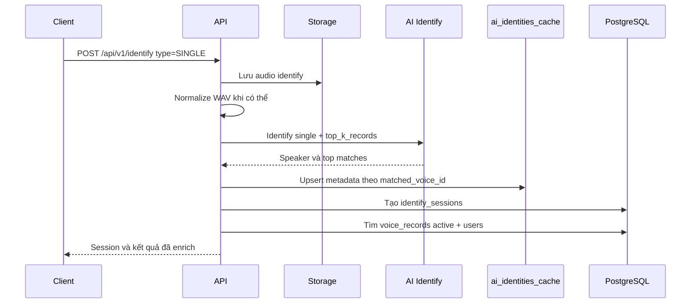
```mermaid
sequenceDiagram
    participant C as Client
    participant A as API
    participant S as Storage
    participant AI as AI Identify
    participant Cache as ai_identities_cache
    participant D as PostgreSQL

    C->>A: POST /api/v1/identify type=SINGLE
    A->>S: Lưu audio identify
    A->>A: Normalize WAV khi có thể
    A->>AI: Identify single + top_k_records
    AI-->>A: Speaker và top matches
    A->>Cache: Upsert metadata theo matched_voice_id
    A->>D: Tạo identify_sessions
    A->>D: Tìm voice_records active + users
    A-->>C: Session và kết quả đã enrich
```

Thứ tự ưu tiên dữ liệu trả về:

1. Business Truth từ `users` và voice record active.
2. Metadata AI từ kết quả identify.
3. Unknown nếu không có match.

## 11. Identify multi

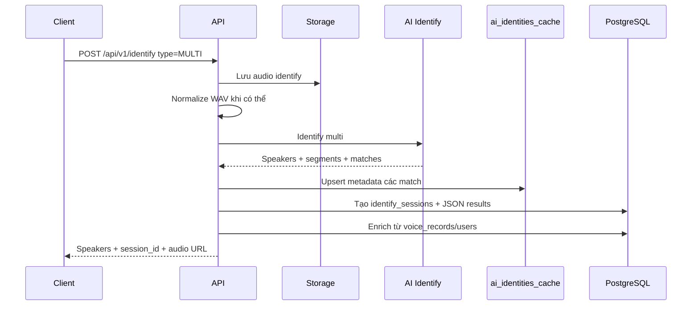
```mermaid
sequenceDiagram
    participant C as Client
    participant A as API
    participant S as Storage
    participant AI as AI Identify
    participant Cache as ai_identities_cache
    participant D as PostgreSQL

    C->>A: POST /api/v1/identify type=MULTI
    A->>S: Lưu audio identify
    A->>A: Normalize WAV khi có thể
    A->>AI: Identify multi
    AI-->>A: Speakers + segments + matches
    A->>Cache: Upsert metadata các match
    A->>D: Tạo identify_sessions + JSON results
    A->>D: Enrich từ voice_records/users
    A-->>C: Speakers + session_id + audio URL
```

Session hiện được tạo với transcript và detected language là null. Speech-to-Text là luồng riêng.

Mỗi speaker có segment sẽ nhận URL streaming từ endpoint session.

## 12. Phiên định danh

### 12.1. Danh sách và chi tiết

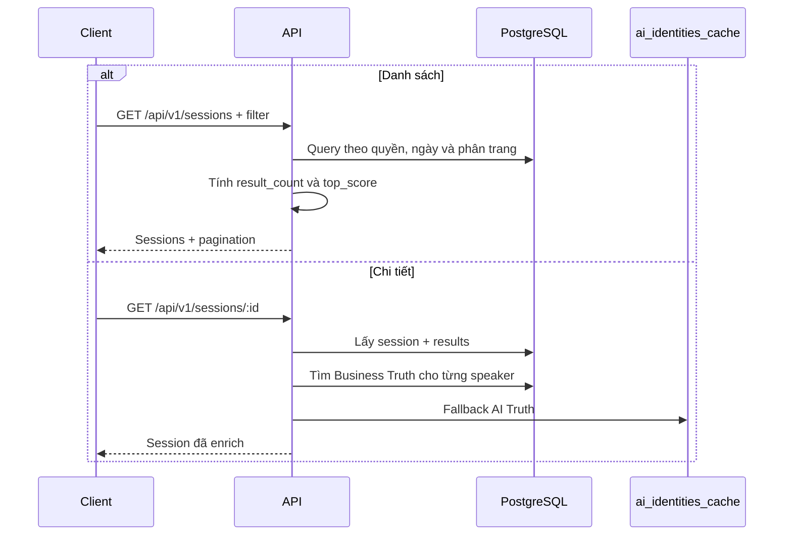
```mermaid
sequenceDiagram
    participant C as Client
    participant A as API
    participant D as PostgreSQL
    participant Cache as ai_identities_cache

    alt Danh sách
        C->>A: GET /api/v1/sessions + filter
        A->>D: Query theo quyền, ngày và phân trang
        A->>A: Tính result_count và top_score
        A-->>C: Sessions + pagination
    else Chi tiết
        C->>A: GET /api/v1/sessions/:id
        A->>D: Lấy session + results
        A->>D: Tìm Business Truth cho từng speaker
        A->>Cache: Fallback AI Truth
        A-->>C: Session đã enrich
    end
```

Operator chỉ xem session của chính mình. Admin có thể xem toàn bộ.

Khi enrich speaker, thứ tự là Business Truth → AI Truth → Unknown.

### 12.2. Audio theo speaker

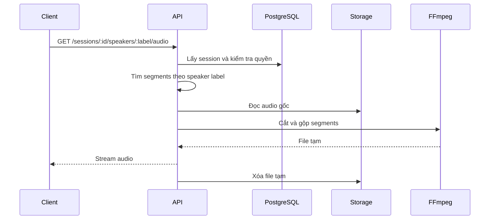
```mermaid
sequenceDiagram
    participant C as Client
    participant A as API
    participant D as PostgreSQL
    participant S as Storage
    participant F as FFmpeg

    C->>A: GET /sessions/:id/speakers/:label/audio
    A->>D: Lấy session và kiểm tra quyền
    A->>A: Tìm segments theo speaker label
    A->>S: Đọc audio gốc
    A->>F: Cắt và gộp segments
    F-->>A: File tạm
    A-->>C: Stream audio
    A->>S: Xóa file tạm
```

## 13. Danh bạ giọng nói

### 13.1. Danh sách và chi tiết

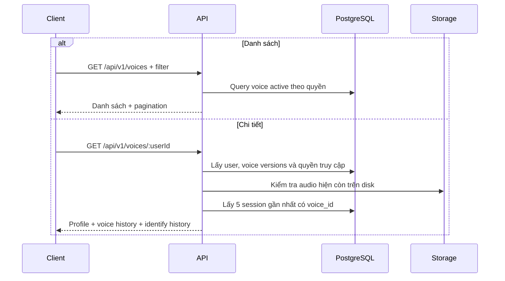
```mermaid
sequenceDiagram
    participant C as Client
    participant A as API
    participant D as PostgreSQL
    participant S as Storage

    alt Danh sách
        C->>A: GET /api/v1/voices + filter
        A->>D: Query voice active theo quyền
        A-->>C: Danh sách + pagination
    else Chi tiết
        C->>A: GET /api/v1/voices/:userId
        A->>D: Lấy user, voice versions và quyền truy cập
        A->>S: Kiểm tra audio hiện còn trên disk
        A->>D: Lấy 5 session gần nhất có voice_id
        A-->>C: Profile + voice history + identify history
    end
```

Nguồn quyền truy cập có thể là:

- `ADMIN`.
- `OWNER`.
- `MATCHED_SESSION`.

### 13.2. Cập nhật thông tin hồ sơ

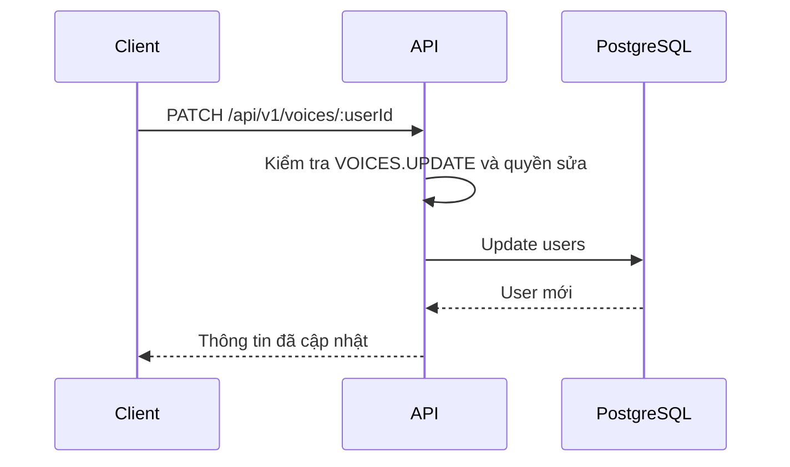
```mermaid
sequenceDiagram
    participant C as Client
    participant A as API
    participant D as PostgreSQL

    C->>A: PATCH /api/v1/voices/:userId
    A->>A: Kiểm tra VOICES.UPDATE và quyền sửa
    A->>D: Update users
    D-->>A: User mới
    A-->>C: Thông tin đã cập nhật
```

Luồng này chỉ cập nhật thông tin cá nhân. Nó không thay đổi embedding tại AI Core.

## 14. Xóa giọng nói

### 14.1. Xóa hồ sơ chính thức

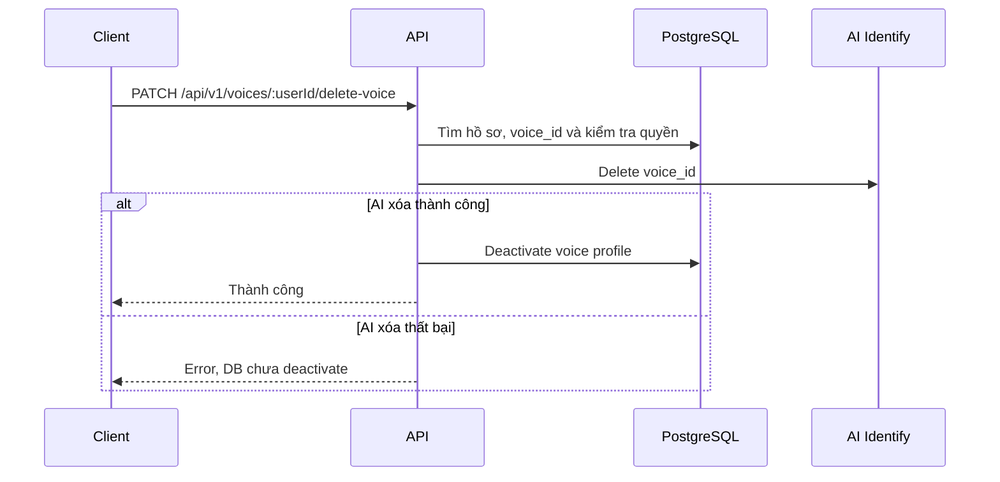
```mermaid
sequenceDiagram
    participant C as Client
    participant A as API
    participant D as PostgreSQL
    participant AI as AI Identify

    C->>A: PATCH /api/v1/voices/:userId/delete-voice
    A->>D: Tìm hồ sơ, voice_id và kiểm tra quyền
    A->>AI: Delete voice_id

    alt AI xóa thành công
        A->>D: Deactivate voice profile
        A-->>C: Thành công
    else AI xóa thất bại
        A-->>C: Error, DB chưa deactivate
    end
```

### 14.2. Xóa voice chỉ tồn tại ở AI Core

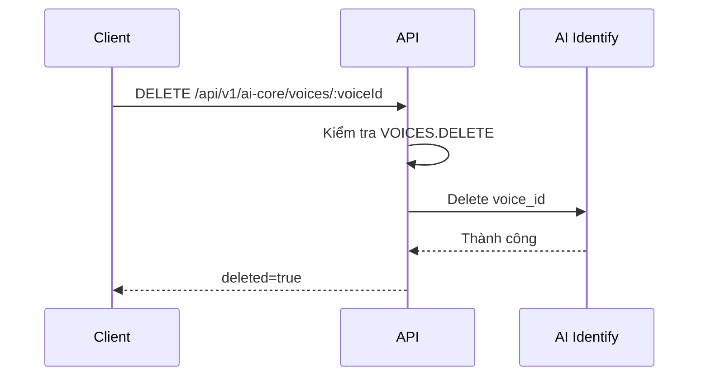
```mermaid
sequenceDiagram
    participant C as Client
    participant A as API
    participant AI as AI Identify

    C->>A: DELETE /api/v1/ai-core/voices/:voiceId
    A->>A: Kiểm tra VOICES.DELETE
    A->>AI: Delete voice_id
    AI-->>A: Thành công
    A-->>C: deleted=true
```

Endpoint AI-only không cập nhật bảng `users` hoặc `voice_records`.

## 15. Cập nhật embedding bằng worker

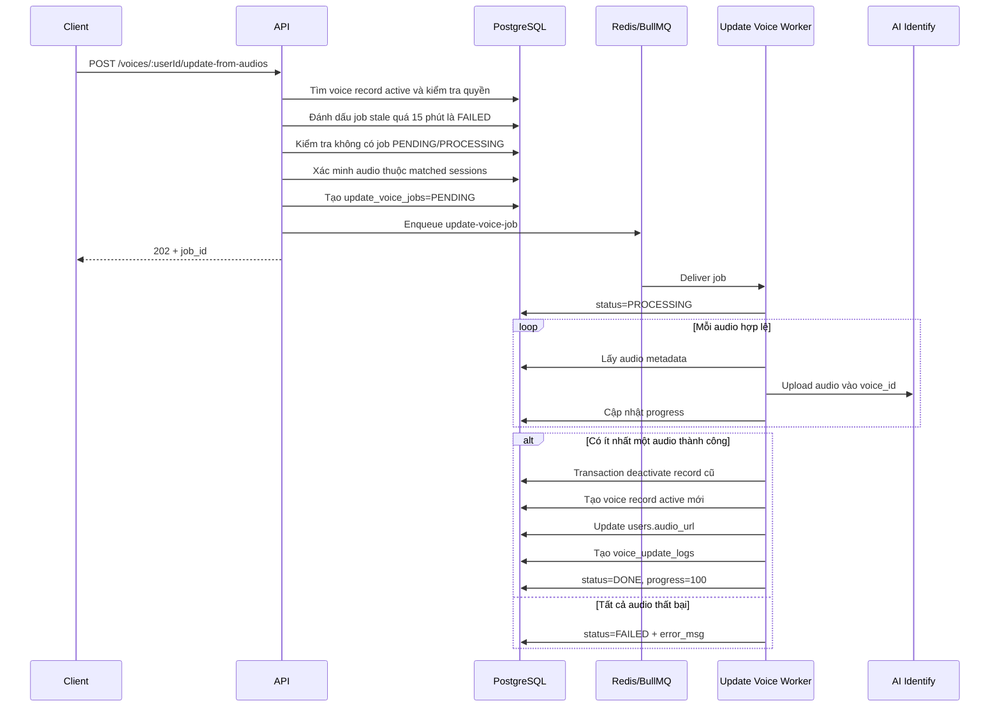
```mermaid
sequenceDiagram
    participant C as Client
    participant A as API
    participant D as PostgreSQL
    participant R as Redis/BullMQ
    participant W as Update Voice Worker
    participant AI as AI Identify

    C->>A: POST /voices/:userId/update-from-audios
    A->>D: Tìm voice record active và kiểm tra quyền
    A->>D: Đánh dấu job stale quá 15 phút là FAILED
    A->>D: Kiểm tra không có job PENDING/PROCESSING
    A->>D: Xác minh audio thuộc matched sessions
    A->>D: Tạo update_voice_jobs=PENDING
    A->>R: Enqueue update-voice-job
    A-->>C: 202 + job_id

    R->>W: Deliver job
    W->>D: status=PROCESSING

    loop Mỗi audio hợp lệ
        W->>D: Lấy audio metadata
        W->>AI: Upload audio vào voice_id
        W->>D: Cập nhật progress
    end

    alt Có ít nhất một audio thành công
        W->>D: Transaction deactivate record cũ
        W->>D: Tạo voice record active mới
        W->>D: Update users.audio_url
        W->>D: Tạo voice_update_logs
        W->>D: status=DONE, progress=100
    else Tất cả audio thất bại
        W->>D: status=FAILED + error_msg
    end
```

BullMQ retry tối đa ba lần với exponential backoff.

Job update voice được lưu lâu dài trong PostgreSQL. Queue chỉ điều phối thực thi.

## 16. Lọc nhiễu audio enroll đang active

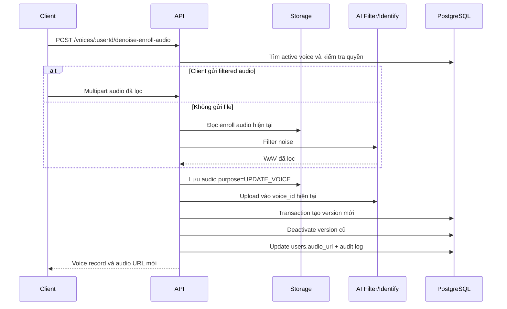
```mermaid
sequenceDiagram
    participant C as Client
    participant A as API
    participant S as Storage
    participant AI as AI Filter/Identify
    participant D as PostgreSQL

    C->>A: POST /voices/:userId/denoise-enroll-audio
    A->>D: Tìm active voice và kiểm tra quyền

    alt Client gửi filtered audio
        C->>A: Multipart audio đã lọc
    else Không gửi file
        A->>S: Đọc enroll audio hiện tại
        A->>AI: Filter noise
        AI-->>A: WAV đã lọc
    end

    A->>S: Lưu audio purpose=UPDATE_VOICE
    A->>AI: Upload vào voice_id hiện tại
    A->>D: Transaction tạo version mới
    A->>D: Deactivate version cũ
    A->>D: Update users.audio_url + audit log
    A-->>C: Voice record và audio URL mới
```

Nếu cập nhật thất bại sau khi tạo audio mới, backend cố xóa file/metadata mới để rollback.

## 17. AI Voice

### 17.1. Danh sách và chi tiết AI Voice

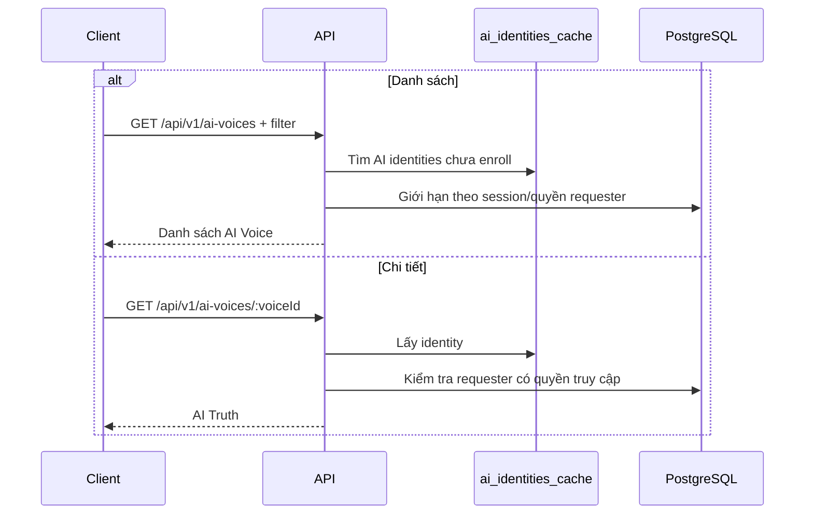
```mermaid
sequenceDiagram
    participant C as Client
    participant A as API
    participant Cache as ai_identities_cache
    participant D as PostgreSQL

    alt Danh sách
        C->>A: GET /api/v1/ai-voices + filter
        A->>Cache: Tìm AI identities chưa enroll
        A->>D: Giới hạn theo session/quyền requester
        A-->>C: Danh sách AI Voice
    else Chi tiết
        C->>A: GET /api/v1/ai-voices/:voiceId
        A->>Cache: Lấy identity
        A->>D: Kiểm tra requester có quyền truy cập
        A-->>C: AI Truth
    end
```

### 17.2. Convert thành hồ sơ chính thức

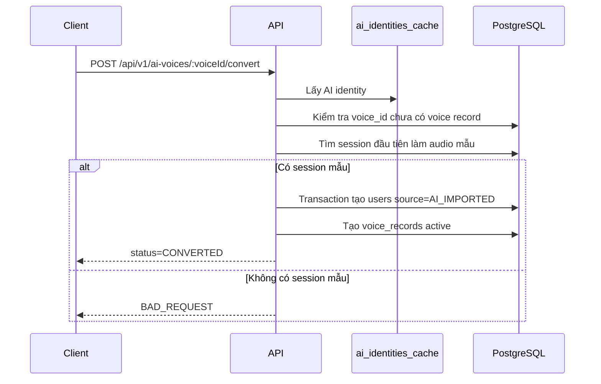
```mermaid
sequenceDiagram
    participant C as Client
    participant A as API
    participant Cache as ai_identities_cache
    participant D as PostgreSQL

    C->>A: POST /api/v1/ai-voices/:voiceId/convert
    A->>Cache: Lấy AI identity
    A->>D: Kiểm tra voice_id chưa có voice record
    A->>D: Tìm session đầu tiên làm audio mẫu

    alt Có session mẫu
        A->>D: Transaction tạo users source=AI_IMPORTED
        A->>D: Tạo voice_records active
        A-->>C: status=CONVERTED
    else Không có session mẫu
        A-->>C: BAD_REQUEST
    end
```

AI cache chỉ là dữ liệu gợi ý. Nó không tự động ghi đè Business Truth trong `users`.

## 18. Chuẩn hóa và lọc nhiễu audio

### 18.1. Normalize

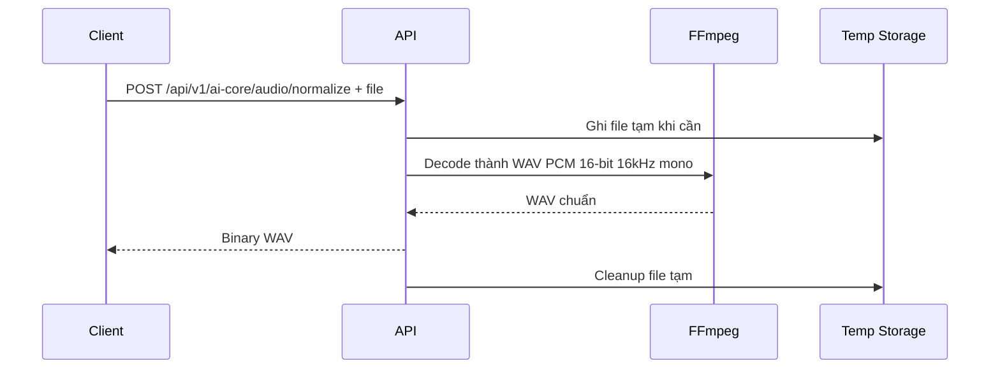
```mermaid
sequenceDiagram
    participant C as Client
    participant A as API
    participant F as FFmpeg
    participant T as Temp Storage

    C->>A: POST /api/v1/ai-core/audio/normalize + file
    A->>T: Ghi file tạm khi cần
    A->>F: Decode thành WAV PCM 16-bit 16kHz mono
    F-->>A: WAV chuẩn
    A-->>C: Binary WAV
    A->>T: Cleanup file tạm
```

### 18.2. Filter noise

```mermaid
sequenceDiagram
    participant C as Client
    participant A as API
    participant AI as AI Filter Noise
    participant F as FFmpeg
    participant T as Temp Storage

    C->>A: POST /api/v1/ai-core/filter-noise + audio/video
    A->>AI: Stream multipart
    AI-->>A: Audio stream
    A->>T: Lưu output tạm
    A->>A: Kiểm tra payload giống audio
    A->>F: Normalize output
    A-->>C: Binary WAV
    A->>T: Cleanup file tạm
```

Nếu AI trả raw PCM, backend thử normalize theo PCM s16le 16kHz mono.

## 19. OCR và Speech-to-Text đồng bộ

```mermaid
sequenceDiagram
    participant C as Client
    participant A as API
    participant AI as AI OCR / S2T

    alt OCR
        C->>A: POST /api/v1/ai-core/ocr + file
        A->>A: Kiểm tra OCR.RUN và input
        A->>AI: Proxy file + language/format
        AI-->>A: OCR result
        A-->>C: Result
    else Speech-to-Text
        C->>A: POST /api/v1/ai-core/speech-to-text + audio
        A->>A: Normalize audio
        A->>A: Tắt denoise nếu file vượt 50 MB
        A->>AI: Proxy audio + options
        AI-->>A: Transcript
        A-->>C: Transcript result
    end
```

Đây là request đồng bộ. Client giữ kết nối đến khi AI trả kết quả hoặc request thất bại.

## 20. OCR và Speech-to-Text job

Các job này không dùng BullMQ worker.

API tạo Promise chạy nền trong chính process API và lưu trạng thái tại Redis với TTL 30 phút.

```mermaid
sequenceDiagram
    participant C as Client
    participant A as API Process
    participant R as Redis
    participant P as PDF Tools
    participant AI as AI OCR / S2T

    C->>A: POST /ocr/jobs hoặc /speech-to-text/jobs
    A->>R: Save pending, progress=0, TTL=30m
    A-->>C: job_id
    A->>A: Start runJob không chờ response
    A->>R: processing, progress=5

    alt OCR PDF
        A->>P: pdfinfo + split PDF theo batch
        loop Từng batch trang
            A->>AI: OCR batch
            A->>R: Update progress + partial result
        end
    else OCR file khác hoặc S2T
        A->>AI: Gọi AI service
    end

    alt Thành công
        A->>R: completed, progress=100, result
    else Thất bại
        A->>R: failed + error
    end

    loop Poll
        C->>A: GET /.../jobs/:jobId
        A->>R: Read job
        A-->>C: status, progress, result/error
    end
```

Nếu API process restart khi job đang chạy, Redis có thể còn trạng thái cũ nhưng tác vụ không được tiếp tục.

## 21. Dịch, tóm tắt và phát hiện ngôn ngữ

### 21.1. Dịch hoặc tóm tắt đồng bộ

```mermaid
sequenceDiagram
    participant C as Client
    participant A as API
    participant AI as AI Translation
    participant D as PostgreSQL

    C->>A: POST /translate hoặc /translate-summarize
    A->>A: Kiểm tra TRANSLATE.RUN
    A->>A: Chia nội dung theo word/character limit

    loop Từng chunk
        A->>AI: Translate hoặc translate_summarize
        AI-->>A: Kết quả chunk
    end

    A->>A: Ghép translated_text
    A->>D: Tạo translation_records
    A-->>C: Result + history_record_id
```

### 21.2. Phát hiện ngôn ngữ

```mermaid
sequenceDiagram
    participant C as Client
    participant A as API
    participant AI as AI Translation

    C->>A: POST /api/v1/ai-core/detect-language
    A->>AI: POST /detect_language
    AI-->>A: Language + score
    A-->>C: Kết quả
```

Detect language không tạo translation history.

## 22. Translation job

Translation job cũng chạy trong API process, không qua BullMQ worker.

```mermaid
sequenceDiagram
    participant C as Client
    participant A as API Process
    participant R as Redis
    participant AI as AI Translation
    participant D as PostgreSQL

    C->>A: POST /translate/jobs hoặc /translate-summarize/jobs
    A->>R: Save pending, TTL=30m
    A-->>C: job_id
    A->>R: processing

    loop Từng chunk
        A->>AI: Translate/summarize chunk
        AI-->>A: Partial result
        A->>R: Update progress + partial translated_text
    end

    alt Thành công
        A->>D: Tạo translation_records
        A->>R: completed + result + history_record_id
    else Thất bại
        A->>R: failed + error
    end

    loop Poll
        C->>A: GET /api/v1/ai-core/translate/jobs/:jobId
        A->>R: Read job
        A-->>C: Job state
    end
```

## 23. Export bản dịch

```mermaid
sequenceDiagram
    participant C as Client
    participant A as API
    participant E as Export Service

    C->>A: POST /api/v1/ai-core/translate/export
    A->>A: Kiểm tra text, format và permission

    alt format=docx
        A->>E: Tạo DOCX bằng docx
    else format=pdf
        A->>E: Tạo PDF bằng pdfmake
    end

    E-->>A: Buffer + MIME + filename
    A-->>C: Binary file download
```

Export không tự tạo hoặc sửa translation history.

## 24. Lịch sử dịch

```mermaid
sequenceDiagram
    participant C as Client
    participant A as API
    participant D as PostgreSQL

    alt Xem lịch sử
        C->>A: GET /api/v1/translate/history + filter
        A->>A: Kiểm tra role ADMIN
        A->>D: Query records + stats + pagination
        A-->>C: Items và thống kê
    else Chỉnh sửa
        C->>A: PATCH /api/v1/translate/history/:id
        A->>D: Lấy record
        A->>A: Admin hoặc chính người tạo
        A->>D: Lưu edited text, editor và thời gian
        A-->>C: Effective translated text
    end
```

Endpoint danh sách hiện chỉ dành cho Admin. Endpoint chỉnh sửa dùng permission và kiểm tra ownership trong use-case.

## 25. Frontend request và silent refresh

```mermaid
sequenceDiagram
    participant UI as Page / Feature
    participant Q as TanStack Query
    participant X as Axios
    participant Auth as Auth Refresh
    participant A as API

    UI->>Q: Query hoặc mutation
    Q->>X: Gọi feature API
    X->>Auth: Lấy access token còn hạn
    Auth-->>X: Token
    X->>A: Request + Bearer token + cookie

    alt API trả 401
        A-->>X: 401
        X->>Auth: Silent refresh
        Auth->>A: POST /auth/refresh + cookie
        A-->>Auth: Token pair mới
        Auth-->>X: Access token mới
        X->>A: Retry request một lần
    end

    A-->>X: Success hoặc ApiError
    X-->>Q: Data/error đã chuẩn hóa
    Q-->>UI: Render
```

Nếu refresh thất bại, frontend xóa auth store, voice result và Query cache rồi chuyển về login.

## 26. Phân loại dữ liệu

| Dữ liệu                | Nơi lưu            | Vòng đời                               |
| ---------------------- | ------------------ | -------------------------------------- |
| Account                | PostgreSQL         | Soft-delete theo status                |
| Refresh token hiện tại | PostgreSQL         | Đến logout, rotate hoặc reset password |
| Access token           | localStorage       | Đến logout/session expired             |
| Refresh token thật     | HTTP-only cookie   | Theo cookie TTL                        |
| Metadata audio         | PostgreSQL         | Theo retention                         |
| File audio             | Storage            | Theo retention                         |
| Voice versions         | PostgreSQL         | Lưu lịch sử active/inactive            |
| Identify session       | PostgreSQL         | Theo retention                         |
| AI identity cache      | PostgreSQL         | Từ kết quả identify                    |
| Update voice job       | PostgreSQL         | Phục vụ audit                          |
| BullMQ queue           | Redis              | Đến khi job hoàn tất/bị xóa            |
| OCR/S2T/translate job  | Redis              | TTL 30 phút                            |
| Translation history    | PostgreSQL         | Theo retention                         |
| File xử lý tạm         | OS temp/Storage    | Xóa sau response/job                   |
| Log                    | File/Docker volume | Theo log rotation                      |

## 27. Ranh giới transaction và rollback

| Luồng               | Transaction/rollback hiện có                     |
| ------------------- | ------------------------------------------------ |
| Upload              | Xóa file nếu insert `audio_files` thất bại       |
| Enroll              | Xóa audio khi AI hoặc DB thất bại                |
| AI Voice convert    | Tạo user + voice record trong Prisma transaction |
| Update voice worker | Version mới, user URL và audit trong transaction |
| Denoise enroll      | Version mới, user URL và audit trong transaction |
| Delete voice        | Xóa AI trước, sau đó deactivate DB               |
| Translation         | AI hoàn tất trước khi ghi history                |

Thao tác AI Core, filesystem, Redis và PostgreSQL không nằm trong một distributed transaction.

Khi lỗi giữa các bước, có thể phát sinh trạng thái lệch giữa AI, DB và Storage. Troubleshooting phải kiểm tra cả ba nguồn.

## 28. Khoảng trống và rủi ro cần theo dõi

- Refresh token đang được lưu trực tiếp dù comment/schema nói là hash.
- OCR/S2T/translation job không có worker bền vững; API restart có thể làm mất tác vụ đang chạy.
- Transcript chưa được ghi vào identify session trong flow identify hiện tại.
- Controller upload hiện chỉ nhận tối đa một file mỗi request.
- Một số rollback chỉ là best-effort.
- Retention của audio, session, AI cache và translation chưa được chốt.
- Chưa có distributed tracing giữa API và AI Core.

## 29. Tài liệu liên quan

- [Kiến trúc hệ thống](system-architecture.md)
- [ERD](erd.md)
- [API tổng quan](../technical/api-overview.md)
- [Troubleshooting](../operations/troubleshooting.md)
