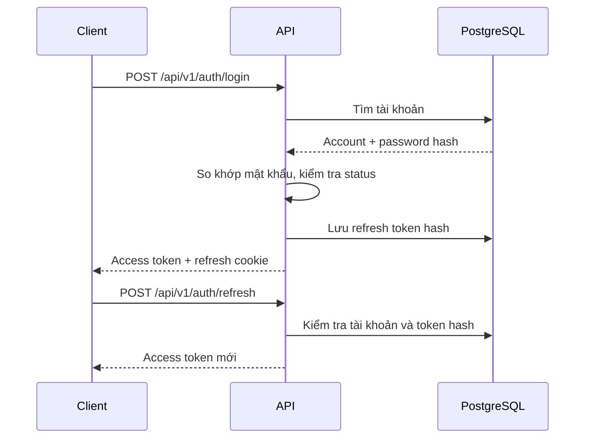
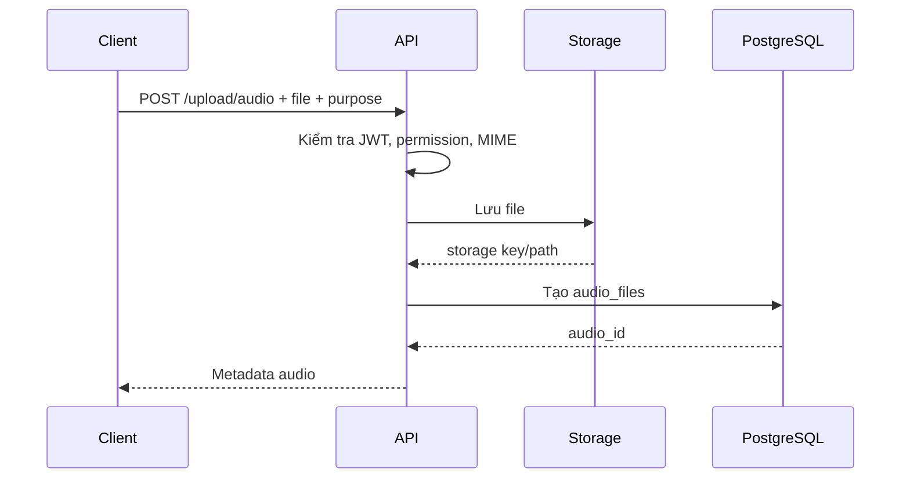
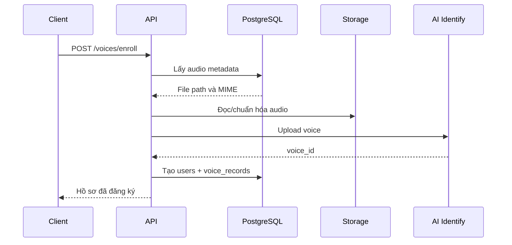
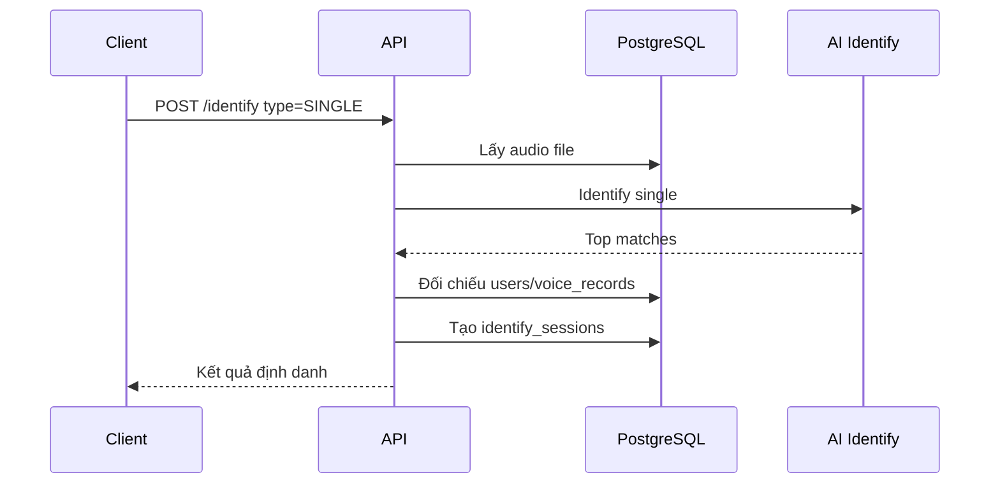
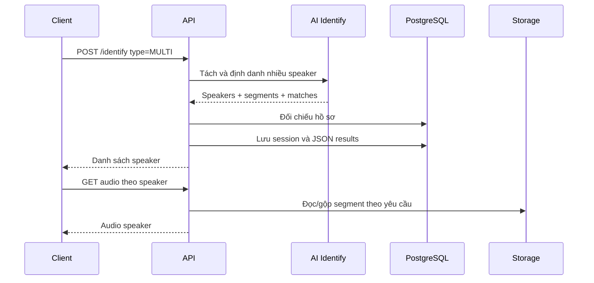
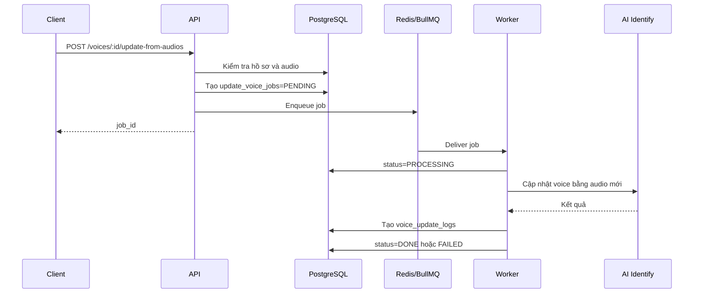
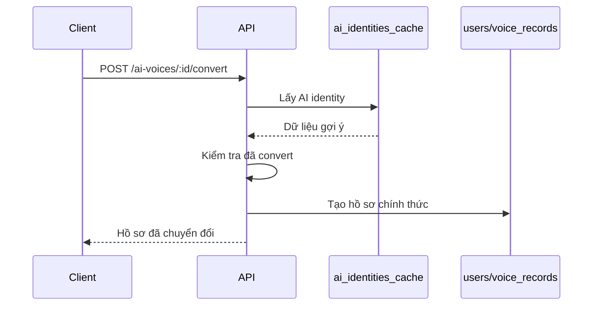
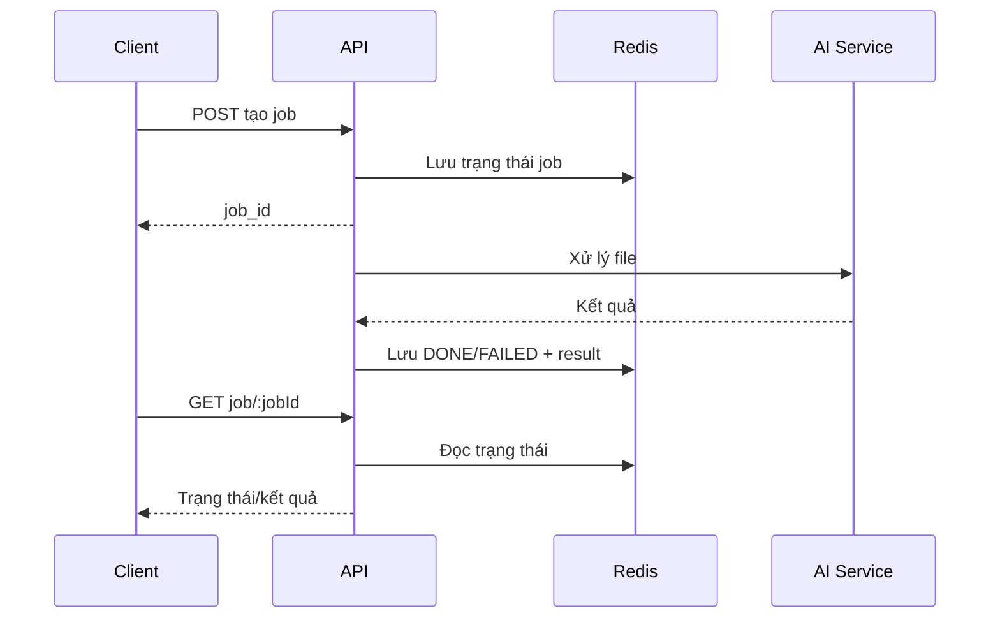
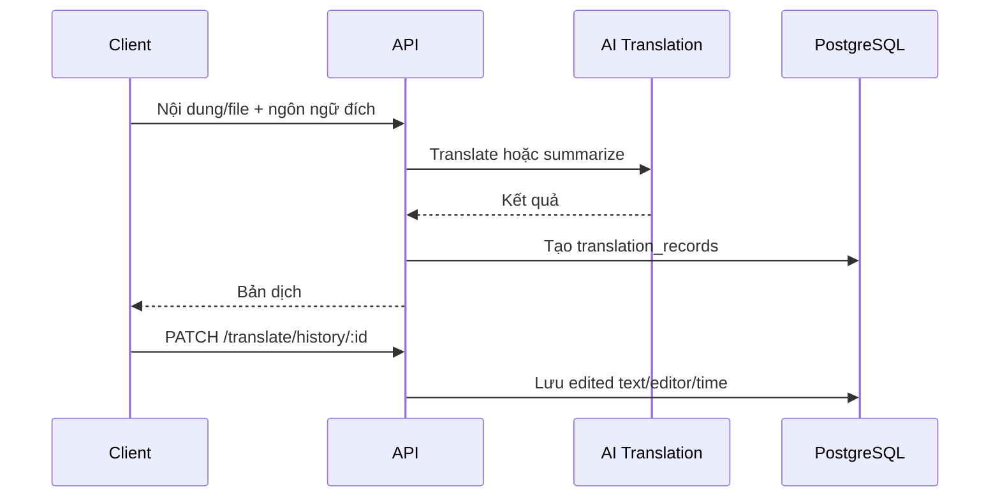

# Luồng dữ liệu

Tài liệu mô tả các luồng nghiệp vụ chính và nơi dữ liệu được lưu.

## 1. Ký hiệu

| Ký hiệu | Ý nghĩa                 |
| ------- | ----------------------- |
| Client  | Giao diện React         |
| API     | NestJS backend          |
| Worker  | Tiến trình xử lý job    |
| DB      | PostgreSQL              |
| Redis   | Queue và trạng thái job |
| Storage | File audio/PDF          |
| AI      | AI Core service         |

## 2. Đăng nhập và refresh token

Dữ liệu nhạy cảm:

- Password chỉ lưu dạng hash.
- Refresh token lưu dạng hash.
- Refresh token thật nằm trong cookie của client.

## 3. Upload audio

Nếu ghi DB thất bại sau khi lưu file, cần kiểm tra file mồ côi trong Storage.

## 4. Enroll giọng nói

Trường hợp cần xử lý:

- Audio không tồn tại.
- MIME không hợp lệ.
- AI Core không kết nối được.
- AI trả dữ liệu không hợp lệ.
- Trùng hồ sơ hoặc vi phạm unique constraint.

## 5. Identify single

Kết quả AI được xem là đề xuất. Thông tin nghiệp vụ trong `users` là nguồn dữ liệu chính thức.

## 6. Identify multi

Audio speaker được tạo theo yêu cầu từ segment của session.

## 7. Cập nhật embedding

Job có các trạng thái `PENDING`, `PROCESSING`, `DONE`, `FAILED`.

Nếu worker dừng, job có thể nằm ở trạng thái chờ. Nếu AI lỗi, `error_msg` phải được kiểm tra.

## 8. AI Voice conversion

`ai_identities_cache` không được phép tự ghi đè dữ liệu chính thức trong `users`.

## 9. OCR và Speech-to-Text job

Job tạm trong Redis cần TTL phù hợp để client còn đủ thời gian lấy kết quả.

## 10. Dịch và lịch sử dịch

Admin có thể xem toàn hệ thống. Người dùng thường chỉ được thao tác dữ liệu thuộc phạm vi quyền.

## 11. Phân loại dữ liệu

| Dữ liệu              | Nơi lưu     | Thời gian lưu           |
| -------------------- | ----------- | ----------------------- |
| Tài khoản            | PostgreSQL  | Theo vòng đời tài khoản |
| Metadata audio       | PostgreSQL  | Theo chính sách dữ liệu |
| File audio           | Storage     | Theo retention          |
| Phiên identify       | PostgreSQL  | Theo retention          |
| Job update voice     | PostgreSQL  | Phục vụ truy vết        |
| Job OCR/S2T/dịch tạm | Redis       | Theo TTL                |
| Lịch sử dịch         | PostgreSQL  | Theo retention          |
| Log                  | File/volume | Theo log rotation       |

Retention phải được chốt trong tài liệu vận hành trước production.

## 12. Tài liệu liên quan

- [Kiến trúc hệ thống](system-architecture.md)
- [ERD](erd.md)
- [API tổng quan](../technical/api-overview.md)
- [Troubleshooting](../operations/troubleshooting.md)
