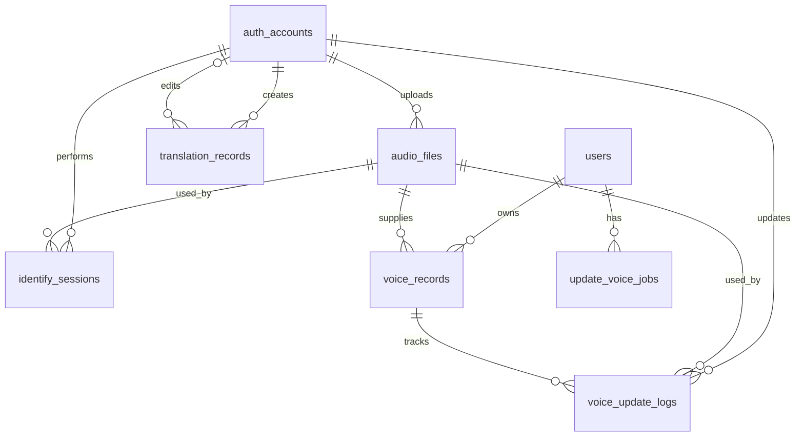

# Sơ đồ ERD

Nguồn chuẩn của mô hình dữ liệu là `apps/api/prisma/schema.prisma`.

## 1. ERD tổng quan



`ai_identities_cache` là bảng độc lập, khóa chính bằng `voice_id` do AI cung cấp.

## 2. Danh sách bảng

| Bảng                  | Trách nhiệm                                           |
| --------------------- | ----------------------------------------------------- |
| `auth_accounts`       | Tài khoản vận hành, role, permission và refresh token |
| `users`               | Thông tin người được định danh                        |
| `ai_identities_cache` | Dữ liệu danh tính tạm do AI gợi ý                     |
| `audio_files`         | Metadata file audio                                   |
| `voice_records`       | Phiên bản hồ sơ giọng nói                             |
| `identify_sessions`   | Lịch sử định danh                                     |
| `update_voice_jobs`   | Job cập nhật embedding                                |
| `voice_update_logs`   | Audit cập nhật giọng nói                              |
| `translation_records` | Lịch sử dịch và chỉnh sửa                             |

## 3. Chi tiết quan hệ

### `auth_accounts`

Quan hệ:

- Một account upload nhiều `audio_files`.
- Một account tạo nhiều `identify_sessions`.
- Một account tạo nhiều `translation_records`.
- Một account có thể chỉnh sửa nhiều `translation_records`.
- Một account tạo nhiều `voice_update_logs`.

Xóa account bị giới hạn ở các quan hệ dùng `onDelete: Restrict`.

### `users`

Quan hệ:

- Một user có nhiều phiên bản `voice_records`.
- Một user có nhiều `update_voice_jobs`.

Xóa user sẽ cascade các voice record và update job liên quan.

### `audio_files`

Quan hệ:

- Một audio có thể được dùng bởi voice record.
- Một audio có thể là đầu vào của identify session.
- Một audio có thể xuất hiện trong voice update log.

File dùng soft-delete qua `deleted_at`. Metadata và file vật lý phải được xử lý nhất quán.

### `voice_records`

Một record thuộc đúng một user và một audio file.

Record có `voice_id` của AI Core và cờ `is_active`.

Mỗi user chỉ có tối đa một record active nhờ partial unique index:

```sql
CREATE UNIQUE INDEX voice_records_user_id_active_unique
ON voice_records (user_id)
WHERE is_active = TRUE;
```

Index này đã được tạo trong migration `20260405100117_redesign_full_schema`.

### `identify_sessions`

Một session thuộc một operator và dùng một audio file.

Kết quả AI được lưu tại `results` dạng JSONB. Transcript và ngôn ngữ phát hiện được lưu cùng session.

### `update_voice_jobs`

Job thuộc một user. Danh sách audio ID lưu dạng JSONB.

Trạng thái:

- `PENDING`.
- `PROCESSING`.
- `DONE`.
- `FAILED`.

`error_msg` lưu thông tin khi job thất bại.

### `voice_update_logs`

Mỗi log tham chiếu:

- Voice record được cập nhật.
- Audio file đã dùng.
- Operator thực hiện.

Đây là dữ liệu audit của quá trình enrich giọng nói.

### `translation_records`

Mỗi bản ghi có operator tạo và có thể có editor.

Khi editor bị xóa, `edited_by` được set null. Bản ghi dịch vẫn được giữ.

### `ai_identities_cache`

Bảng lưu snapshot dữ liệu do AI trả về.

Quy tắc nghiệp vụ: AI chỉ đề xuất danh tính. Không tự động ghi đè `users`.

## 4. Enum

| Enum              | Giá trị                                   |
| ----------------- | ----------------------------------------- |
| `Role`            | `ADMIN`, `OPERATOR`                       |
| `UserStatus`      | `ACTIVE`, `INACTIVE`                      |
| `JobStatus`       | `PENDING`, `PROCESSING`, `DONE`, `FAILED` |
| `AudioPurpose`    | `ENROLL`, `IDENTIFY`, `UPDATE_VOICE`      |
| `UserSource`      | `SYSTEM`, `AI_IMPORTED`                   |
| `UserGender`      | `MALE`, `FEMALE`, `OTHER`                 |
| `TranslationMode` | `TRANSLATE`, `SUMMARIZE`                  |

## 5. Khóa và index quan trọng

| Bảng                  | Index/constraint                                        |
| --------------------- | ------------------------------------------------------- |
| `auth_accounts`       | Unique `email`, unique `username`                       |
| `users`               | Index `name`, `citizen_identification`, `phone_number`  |
| `audio_files`         | Unique `file_path`; index purpose, uploader, deleted_at |
| `voice_records`       | Index user, active state, voice_id; unique active/user  |
| `identify_sessions`   | Index operator, identified_at                           |
| `update_voice_jobs`   | Index voice_id, status, user_id                         |
| `voice_update_logs`   | Index voice_record, voice_id, audio                     |
| `translation_records` | Index user, time, target language, mode, editor         |

## 6. Quy tắc xóa

| Quan hệ                             | Chính sách |
| ----------------------------------- | ---------- |
| User → voice records                | Cascade    |
| User → update jobs                  | Cascade    |
| Account → audio/session/translation | Restrict   |
| Voice record → update logs          | Cascade    |
| Translation editor                  | SetNull    |

Trước khi xóa dữ liệu, phải đánh giá cả metadata database và file vật lý trong Storage.

## 7. Migration

Development:

```bash
pnpm prisma:migrate
```

Production:

```bash
pnpm infra:prod:migrate
```

Kiểm tra:

```bash
pnpm --filter api exec prisma migrate status
```

Không sửa migration đã chạy và không dùng `migrate reset` trên production.

## 8. Hạn chế và việc cần chốt

- Các trường JSONB chưa có schema database chi tiết.
- Retention của session, audio, log và translation chưa được chốt trong code.
- Cần quy trình backup/restore trước production.
- Cần xác định dữ liệu cá nhân nào phải mã hóa hoặc ẩn danh.
- Cần kiểm tra file mồ côi khi transaction DB và thao tác Storage không cùng thành công.

## 9. Tài liệu liên quan

- [Luồng dữ liệu](data-flow.md)
- [Kiến trúc hệ thống](system-architecture.md)
- [Cấu trúc dự án](../technical/project-structure.md)
- Prisma schema: `apps/api/prisma/schema.prisma`
- Migration: `apps/api/prisma/migrations`
