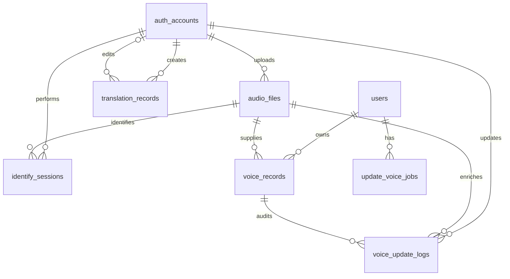
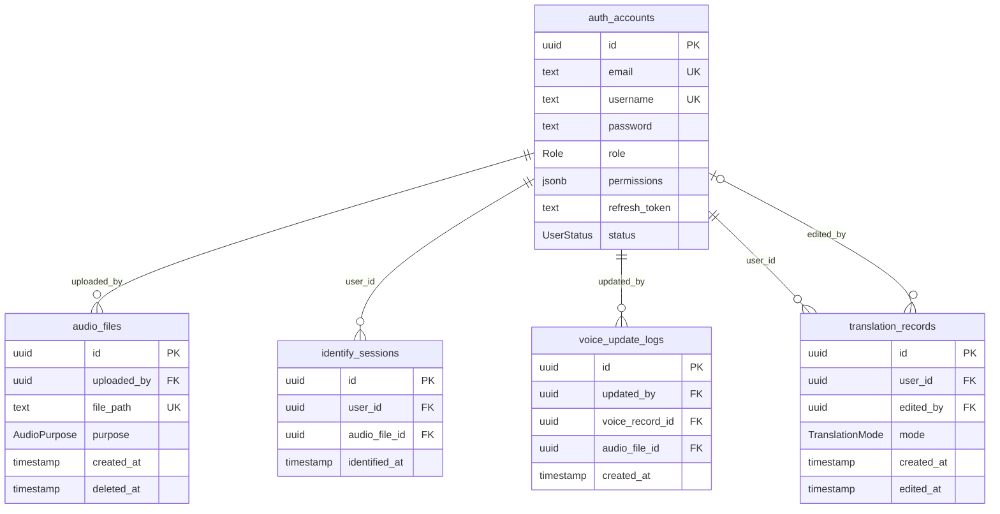
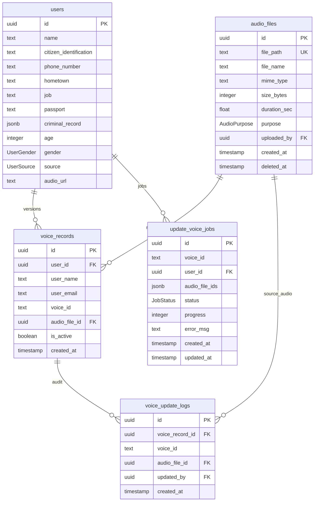
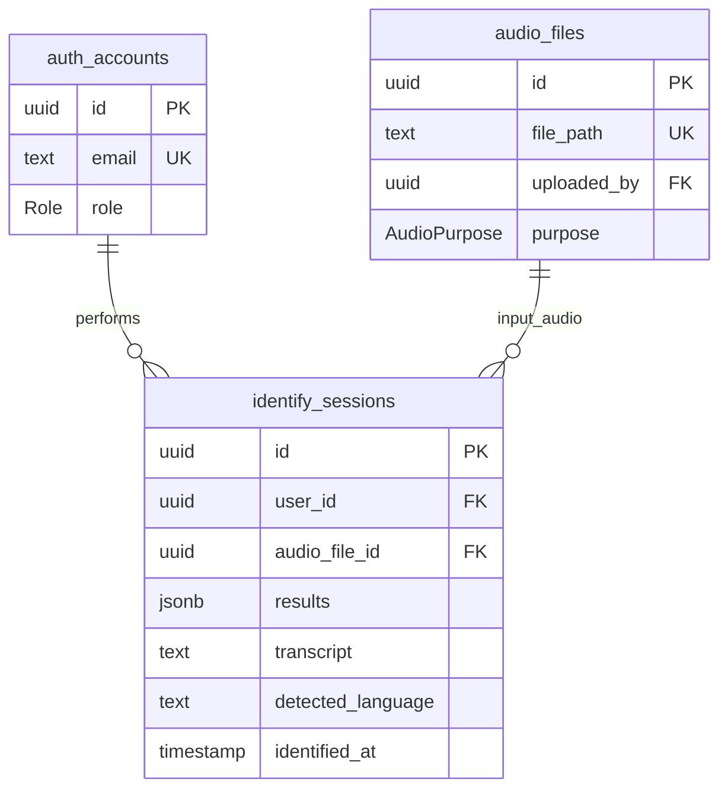
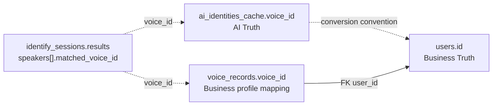
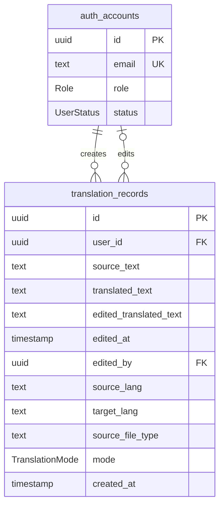

# Sơ đồ ERD

Tài liệu mô tả mô hình dữ liệu PostgreSQL của hệ thống định danh giọng nói.

Nguồn khai báo là `apps/api/prisma/schema.prisma`. Trạng thái database thực tế được xác định bởi schema đã deploy và toàn bộ migration trong `apps/api/prisma/migrations`.

## 1. Quy ước

| Ký hiệu                   | Ý nghĩa                                       |
| ------------------------- | --------------------------------------------- |
| PK                        | Khóa chính                                    |
| FK                        | Khóa ngoại                                    |
| UK                        | Ràng buộc duy nhất                            |
| NN                        | Không được null                               |
| JSONB                     | Dữ liệu JSON, không được database kiểm tra FK |
| <code>&#124;&#124;</code> | Bắt buộc đúng một                             |
| <code>o&#124;</code>      | Không hoặc một                                |
| <code>o{</code>           | Không hoặc nhiều                              |
| <code>&#124;{</code>      | Một hoặc nhiều                                |

Quan hệ vẽ bằng đường ER là quan hệ FK thật, trừ khi phần mô tả ghi rõ đó là quan hệ logic.

## 2. ERD tổng quan



`ai_identities_cache` không có FK. Bảng này liên kết logic với kết quả Identify và `voice_records` qua `voice_id`.

`update_voice_jobs.audio_file_ids` chứa danh sách ID dạng JSONB. Database không tạo FK từ danh sách này tới `audio_files`.

## 3. ERD tài khoản và phân quyền



`auth_accounts` là tài khoản đăng nhập của Admin và Operator. Bảng này không phải hồ sơ người được định danh trong bảng `users`.

## 4. ERD hồ sơ giọng nói và audio



Mỗi `users` có thể có nhiều phiên bản `voice_records`, nhưng chỉ được có tối đa một record active.

`voice_id` là ID của giọng nói trong AI Core/Qdrant. Trường này không unique vì nhiều phiên bản của cùng một hồ sơ có thể dùng chung `voice_id`.

## 5. ERD phiên định danh và AI identity

### 5.1. Quan hệ vật lý



### 5.2. Quan hệ logic qua `voice_id`



Các đường nét đứt không phải FK. Database không ngăn `matched_voice_id` trong JSONB tham chiếu tới một voice không tồn tại.

Khi Enroll hoặc Convert AI Voice, code hiện dùng `voice_id` làm `users.id`. Đây là quy ước implementation, không phải constraint được schema đảm bảo.

## 6. ERD lịch sử dịch



`user_id` dùng `onDelete: Restrict`. `edited_by` dùng `onDelete: SetNull` để giữ bản ghi dịch khi tài khoản editor bị xóa.

## 7. Từ điển dữ liệu

### 7.1. `auth_accounts`

| Cột             | Kiểu         | Null/default     | Ràng buộc | Mô tả                          |
| --------------- | ------------ | ---------------- | --------- | ------------------------------ |
| `id`            | UUID         | NN, UUID tự sinh | PK        | ID tài khoản đăng nhập         |
| `email`         | TEXT         | NN               | UK        | Email đăng nhập                |
| `username`      | TEXT         | Có               | UK        | Tên đăng nhập                  |
| `password`      | TEXT         | NN               |           | Password đã hash               |
| `role`          | `Role`       | NN, `ADMIN`      |           | Vai trò tài khoản              |
| `permissions`   | JSONB        | Có               |           | Danh sách permission tùy chỉnh |
| `refresh_token` | TEXT         | Có               |           | Refresh token hiện tại         |
| `status`        | `UserStatus` | NN, `ACTIVE`     |           | Trạng thái hoạt động           |

Dữ liệu nhạy cảm: `password`, `refresh_token`, email và permission.

Schema comment nói refresh token được hash, nhưng use case hiện lưu token trực tiếp và so sánh chuỗi.

### 7.2. `users`

| Cột                      | Kiểu         | Null/default     | Ràng buộc | Mô tả                           |
| ------------------------ | ------------ | ---------------- | --------- | ------------------------------- |
| `id`                     | UUID         | NN, UUID tự sinh | PK        | ID hồ sơ người được định danh   |
| `name`                   | TEXT         | NN               | Index     | Họ tên                          |
| `citizen_identification` | TEXT         | Có               | Index     | CCCD/CMND                       |
| `phone_number`           | TEXT         | Có               | Index     | Số điện thoại                   |
| `hometown`               | TEXT         | Có               |           | Quê quán                        |
| `job`                    | TEXT         | Có               |           | Nghề nghiệp                     |
| `passport`               | TEXT         | Có               |           | Số hộ chiếu                     |
| `criminal_record`        | JSONB        | Có               |           | Danh sách tiền án, tiền sự      |
| `age`                    | INTEGER      | Có               |           | Tuổi                            |
| `gender`                 | `UserGender` | Có               |           | Giới tính                       |
| `source`                 | `UserSource` | NN, `SYSTEM`     |           | Nguồn tạo hồ sơ                 |
| `audio_url`              | TEXT         | Có               |           | URL audio đại diện được lưu lặp |

`users` là Business Truth. CCCD, số điện thoại và hộ chiếu hiện được index nhưng không có unique constraint.

### 7.3. `ai_identities_cache`

| Cột                      | Kiểu      | Null/default           | Ràng buộc | Mô tả                      |
| ------------------------ | --------- | ---------------------- | --------- | -------------------------- |
| `voice_id`               | TEXT      | NN                     | PK        | ID voice do AI Core trả về |
| `name`                   | TEXT      | Có                     |           | Tên AI gợi ý               |
| `citizen_identification` | TEXT      | Có                     |           | CCCD/CMND AI gợi ý         |
| `phone_number`           | TEXT      | Có                     |           | Điện thoại AI gợi ý        |
| `hometown`               | TEXT      | Có                     |           | Quê quán AI gợi ý          |
| `job`                    | TEXT      | Có                     |           | Nghề nghiệp AI gợi ý       |
| `passport`               | TEXT      | Có                     |           | Hộ chiếu AI gợi ý          |
| `criminal_record`        | JSONB     | Có                     |           | Tiền án, tiền sự AI gợi ý  |
| `raw`                    | JSONB     | NN                     |           | Payload AI gốc             |
| `first_seen_at`          | TIMESTAMP | NN, thời điểm hiện tại |           | Lần đầu nhìn thấy voice    |

Bảng này là AI Truth và không được tự động ghi đè `users`.

Upsert hiện cập nhật metadata và `raw`, nhưng không cập nhật lại `first_seen_at`.

### 7.4. `audio_files`

| Cột            | Kiểu             | Null/default           | Ràng buộc | Mô tả                        |
| -------------- | ---------------- | ---------------------- | --------- | ---------------------------- |
| `id`           | UUID             | NN, UUID tự sinh       | PK        | ID metadata file             |
| `file_path`    | TEXT             | NN                     | UK        | Đường dẫn file trong Storage |
| `file_name`    | TEXT             | NN                     |           | Tên file gốc                 |
| `mime_type`    | TEXT             | NN                     |           | MIME type                    |
| `size_bytes`   | INTEGER          | NN                     |           | Kích thước byte              |
| `duration_sec` | DOUBLE PRECISION | Có                     |           | Thời lượng giây              |
| `purpose`      | `AudioPurpose`   | NN                     | Index     | Mục đích upload              |
| `uploaded_by`  | UUID             | NN                     | FK, Index | Account upload               |
| `created_at`   | TIMESTAMP        | NN, thời điểm hiện tại |           | Thời điểm upload             |
| `deleted_at`   | TIMESTAMP        | Có                     | Index     | Thời điểm soft-delete        |

`file_path` là metadata. Việc file vật lý còn tồn tại phải được kiểm tra tại Storage.

### 7.5. `voice_records`

| Cột             | Kiểu      | Null/default           | Ràng buộc       | Mô tả                       |
| --------------- | --------- | ---------------------- | --------------- | --------------------------- |
| `id`            | UUID      | NN, UUID tự sinh       | PK              | ID phiên bản voice          |
| `user_id`       | UUID      | NN                     | FK, Index       | Hồ sơ sở hữu                |
| `user_name`     | TEXT      | Có                     |                 | Snapshot tên                |
| `user_email`    | TEXT      | Có                     |                 | Snapshot email              |
| `voice_id`      | TEXT      | NN                     | Index           | ID voice tại AI Core/Qdrant |
| `audio_file_id` | UUID      | NN                     | FK              | Audio đại diện phiên bản    |
| `is_active`     | BOOLEAN   | NN, `true`             | Composite index | Phiên bản đang hoạt động    |
| `created_at`    | TIMESTAMP | NN, thời điểm hiện tại |                 | Thời điểm tạo phiên bản     |

Partial unique index bảo đảm mỗi `user_id` chỉ có tối đa một record với `is_active = true`.

`user_name` và `user_email` là snapshot. Dữ liệu hồ sơ hiện tại vẫn phải đọc từ `users`.

### 7.6. `identify_sessions`

| Cột                 | Kiểu      | Null/default           | Ràng buộc | Mô tả                   |
| ------------------- | --------- | ---------------------- | --------- | ----------------------- |
| `id`                | UUID      | NN, UUID tự sinh       | PK        | ID phiên định danh      |
| `user_id`           | UUID      | NN                     | FK, Index | Operator thực hiện      |
| `audio_file_id`     | UUID      | NN                     | FK        | Audio đầu vào           |
| `results`           | JSONB     | NN                     |           | Speaker và kết quả AI   |
| `transcript`        | TEXT      | Có, mặc định `""`      |           | Nội dung Speech-to-Text |
| `detected_language` | TEXT      | Có, mặc định `""`      |           | Ngôn ngữ phát hiện      |
| `identified_at`     | TIMESTAMP | NN, thời điểm hiện tại | Index     | Thời điểm thực hiện     |

Có composite index `(user_id, identified_at)` để lọc lịch sử theo operator và thời gian.

Identify hiện ghi `transcript` và `detected_language` là null. Hai trường đã tồn tại nhưng chưa được flow Identify điền dữ liệu.

### 7.7. `update_voice_jobs`

| Cột              | Kiểu        | Null/default           | Ràng buộc | Mô tả                          |
| ---------------- | ----------- | ---------------------- | --------- | ------------------------------ |
| `id`             | UUID        | NN, UUID tự sinh       | PK        | ID job                         |
| `voice_id`       | TEXT        | NN                     | Index     | Voice cần cập nhật             |
| `user_id`        | UUID        | NN                     | FK, Index | Hồ sơ sở hữu                   |
| `audio_file_ids` | JSONB       | NN                     |           | Mảng ID audio đầu vào          |
| `status`         | `JobStatus` | NN, `PENDING`          | Index     | Trạng thái job                 |
| `progress`       | INTEGER     | NN, `0`                |           | Tiến độ từ 0 đến 100 theo code |
| `error_msg`      | TEXT        | Có                     |           | Thông báo lỗi                  |
| `created_at`     | TIMESTAMP   | NN, thời điểm hiện tại |           | Thời điểm tạo                  |
| `updated_at`     | TIMESTAMP   | NN, tự cập nhật        |           | Thời điểm cập nhật gần nhất    |

Schema chưa có CHECK constraint bảo đảm `progress` nằm trong khoảng 0–100.

Schema cũng chưa có unique constraint ngăn nhiều job `PENDING` hoặc `PROCESSING`. Use case kiểm tra xung đột ở tầng ứng dụng.

### 7.8. `voice_update_logs`

| Cột               | Kiểu      | Null/default           | Ràng buộc | Mô tả                |
| ----------------- | --------- | ---------------------- | --------- | -------------------- |
| `id`              | UUID      | NN, UUID tự sinh       | PK        | ID audit log         |
| `voice_record_id` | UUID      | NN                     | FK, Index | Phiên bản voice mới  |
| `voice_id`        | TEXT      | NN                     | Index     | ID voice tại AI Core |
| `audio_file_id`   | UUID      | NN                     | FK, Index | Audio dùng để enrich |
| `updated_by`      | UUID      | NN                     | FK        | Account thực hiện    |
| `created_at`      | TIMESTAMP | NN, thời điểm hiện tại |           | Thời điểm cập nhật   |

Một lần cập nhật nhiều audio sẽ tạo nhiều log cùng trỏ tới phiên bản voice mới.

### 7.9. `translation_records`

| Cột                      | Kiểu              | Null/default           | Ràng buộc | Mô tả                |
| ------------------------ | ----------------- | ---------------------- | --------- | -------------------- |
| `id`                     | UUID              | NN, UUID tự sinh       | PK        | ID lịch sử dịch      |
| `user_id`                | UUID              | NN                     | FK, Index | Account tạo          |
| `source_text`            | TEXT              | NN                     |           | Nội dung nguồn       |
| `translated_text`        | TEXT              | NN                     |           | Kết quả ban đầu      |
| `edited_translated_text` | TEXT              | Có                     |           | Kết quả đã chỉnh sửa |
| `edited_at`              | TIMESTAMP         | Có                     |           | Thời điểm chỉnh sửa  |
| `edited_by`              | UUID              | Có                     | FK, Index | Account chỉnh sửa    |
| `source_lang`            | TEXT              | Có                     |           | Ngôn ngữ nguồn       |
| `target_lang`            | TEXT              | NN                     | Index     | Ngôn ngữ đích        |
| `source_file_type`       | TEXT              | Có                     |           | Loại file nguồn      |
| `mode`                   | `TranslationMode` | NN, `TRANSLATE`        | Index     | Dịch hoặc tóm tắt    |
| `created_at`             | TIMESTAMP         | NN, thời điểm hiện tại | Index     | Thời điểm tạo        |

Giá trị hiệu lực là `edited_translated_text` nếu có; nếu không thì dùng `translated_text`.

## 8. Cấu trúc JSONB

PostgreSQL chỉ kiểm tra dữ liệu là JSON hợp lệ. Kiểu và quan hệ bên trong được kiểm tra bởi code ứng dụng.

### 8.1. `auth_accounts.permissions`

```json
[
  "profile.read",
  "voices.read",
  "voices.enroll",
  "identify.run",
  "sessions.read"
]
```

Giá trị hợp lệ được định nghĩa tại `apps/api/src/common/auth/permissions.ts`.

Admin luôn được resolve thành toàn bộ permission. Operator dùng danh sách đã lưu hoặc permission mặc định khi danh sách rỗng.

### 8.2. `users.criminal_record`

```json
[
  {
    "case": "Tên vụ việc",
    "year": 2024
  }
]
```

DTO hiện yêu cầu `case` là chuỗi không rỗng và `year` nằm trong khoảng 1900–2100.

### 8.3. `identify_sessions.results`

Format hiện tại:

```json
{
  "speakers": [
    {
      "speaker_label": "SPEAKER_1",
      "matched_voice_id": "voice-id-or-null",
      "score": 0.91,
      "name": "Tên do AI gợi ý",
      "segments": [
        {
          "start": 0.5,
          "end": 3.8
        }
      ],
      "raw_ai_data": {}
    }
  ],
  "transcript": null,
  "detected_language": null,
  "transcript_segments": [],
  "speaker_transcripts": []
}
```

Code đọc session hỗ trợ cả format cũ là mảng speaker và format mới là object có thuộc tính `speakers`.

Một số truy vấn JSONB hiện vẫn dùng `array_contains` ở top-level. Truy vấn này có nguy cơ không khớp format object mới và cần test hồi quy.

### 8.4. `update_voice_jobs.audio_file_ids`

```json
["5e20125d-9fb6-4f0e-8766-23c3e00fc123", "122bb5ef-b448-49ca-b43e-8884bfb6700c"]
```

Mỗi phần tử phải là UUID của `audio_files.id`, nhưng database không có FK và không tự kiểm tra record tồn tại.

### 8.5. `ai_identities_cache.raw`

```json
{
  "matched_voice_id": "voice-id",
  "score": 0.91,
  "name": "Tên do AI gợi ý",
  "segments": []
}
```

Đây là payload AI gốc. Cấu trúc có thể thay đổi theo phiên bản AI Core nên consumer phải xử lý field thiếu.

## 9. Enum

| Enum              | Giá trị                                   |
| ----------------- | ----------------------------------------- |
| `Role`            | `ADMIN`, `OPERATOR`                       |
| `UserStatus`      | `ACTIVE`, `INACTIVE`                      |
| `JobStatus`       | `PENDING`, `PROCESSING`, `DONE`, `FAILED` |
| `AudioPurpose`    | `ENROLL`, `IDENTIFY`, `UPDATE_VOICE`      |
| `UserSource`      | `SYSTEM`, `AI_IMPORTED`                   |
| `UserGender`      | `MALE`, `FEMALE`, `OTHER`                 |
| `TranslationMode` | `TRANSLATE`, `SUMMARIZE`                  |

## 10. Foreign key và chính sách xóa

| Bảng con              | Cột FK            | Bảng cha        | Khi xóa bảng cha |
| --------------------- | ----------------- | --------------- | ---------------- |
| `audio_files`         | `uploaded_by`     | `auth_accounts` | Restrict         |
| `voice_records`       | `user_id`         | `users`         | Cascade          |
| `voice_records`       | `audio_file_id`   | `audio_files`   | Restrict         |
| `identify_sessions`   | `user_id`         | `auth_accounts` | Restrict         |
| `identify_sessions`   | `audio_file_id`   | `audio_files`   | Restrict         |
| `update_voice_jobs`   | `user_id`         | `users`         | Cascade          |
| `voice_update_logs`   | `voice_record_id` | `voice_records` | Cascade          |
| `voice_update_logs`   | `audio_file_id`   | `audio_files`   | Restrict         |
| `voice_update_logs`   | `updated_by`      | `auth_accounts` | Restrict         |
| `translation_records` | `user_id`         | `auth_accounts` | Restrict         |
| `translation_records` | `edited_by`       | `auth_accounts` | SetNull          |

Xóa `users` sẽ xóa lịch sử `voice_records`, `update_voice_jobs` và các `voice_update_logs` phụ thuộc voice record.

Xóa metadata audio bị chặn nếu audio đang được voice record, identify session hoặc audit log tham chiếu.

## 11. Index và constraint

| Bảng                  | Index/constraint                                     | Mục đích                      |
| --------------------- | ---------------------------------------------------- | ----------------------------- |
| `auth_accounts`       | Unique `email`                                       | Không trùng email             |
| `auth_accounts`       | Unique `username`                                    | Không trùng username          |
| `users`               | Index `name`                                         | Tìm theo tên                  |
| `users`               | Index `citizen_identification`                       | Tìm theo CCCD                 |
| `users`               | Index `phone_number`                                 | Tìm theo số điện thoại        |
| `audio_files`         | Unique `file_path`                                   | Không trùng đường dẫn         |
| `audio_files`         | Index `purpose`, `uploaded_by`, `deleted_at`         | Lọc file                      |
| `voice_records`       | Index `user_id`, `(user_id, is_active)`              | Tìm phiên bản active          |
| `voice_records`       | Index `voice_id`                                     | Ánh xạ kết quả AI             |
| `voice_records`       | Partial unique active/user                           | Tối đa một active record/user |
| `identify_sessions`   | Index `user_id`, `identified_at`                     | Lọc lịch sử                   |
| `identify_sessions`   | Index `(user_id, identified_at)`                     | Lọc operator theo thời gian   |
| `update_voice_jobs`   | Index `voice_id`, `status`, `user_id`                | Theo dõi job                  |
| `update_voice_jobs`   | Index `(voice_id, status)`                           | Tìm job đang chạy             |
| `voice_update_logs`   | Index `voice_record_id`, `voice_id`, `audio_file_id` | Tra cứu audit                 |
| `translation_records` | Index `user_id`, `created_at`, `target_lang`         | Lọc lịch sử dịch              |
| `translation_records` | Index `mode`, `edited_by`                            | Lọc mode và editor            |

Partial unique index được tạo thủ công vì Prisma schema chưa biểu diễn đầy đủ partial index:

```sql
CREATE UNIQUE INDEX voice_records_user_id_active_unique
ON voice_records (user_id)
WHERE is_active = TRUE;
```

Không xóa index này khi tạo migration mới.

## 12. Quy tắc nghiệp vụ và nguồn dữ liệu chuẩn

### 12.1. Nguồn dữ liệu chuẩn

| Dữ liệu                             | Nguồn chuẩn                               |
| ----------------------------------- | ----------------------------------------- |
| Tài khoản, role, permission         | `auth_accounts`                           |
| Hồ sơ người được định danh          | `users`                                   |
| Voice đang hoạt động                | `voice_records` có `is_active = true`     |
| Metadata do AI gợi ý                | `ai_identities_cache`                     |
| File và đường dẫn vật lý            | `audio_files` kết hợp Storage             |
| Kết quả Identify tại thời điểm chạy | `identify_sessions.results`               |
| Trạng thái Update Voice             | `update_voice_jobs`                       |
| Audit Update Voice                  | `voice_update_logs`                       |
| Bản dịch hiệu lực                   | Bản edited nếu có, nếu không dùng bản gốc |

Khi enrich kết quả Identify, độ ưu tiên là `users` và active `voice_records`, sau đó mới dùng `ai_identities_cache`.

### 12.2. Versioning voice

Khi Update Voice thành công, worker deactivate record cũ và tạo record mới trong cùng Prisma transaction.

Partial unique index bảo vệ invariant một active record cho mỗi user ngay cả khi tầng ứng dụng có race condition.

Các thao tác gọi AI Core xảy ra ngoài transaction PostgreSQL. AI có thể đã cập nhật nhưng transaction DB vẫn thất bại.

### 12.3. Quyền sở hữu

`audio_files.uploaded_by` và `identify_sessions.user_id` xác định operator tạo dữ liệu.

Admin có thể xem toàn hệ thống. Operator bị giới hạn theo session, audio hoặc permission ở tầng ứng dụng; schema không triển khai row-level security.

## 13. Phân loại dữ liệu nhạy cảm

| Mức độ        | Dữ liệu                                                    |
| ------------- | ---------------------------------------------------------- |
| Bí mật        | Password hash, refresh token                               |
| Cá nhân cao   | CCCD/CMND, hộ chiếu, tiền án tiền sự                       |
| Cá nhân       | Họ tên, điện thoại, quê quán, nghề nghiệp, tuổi, giới tính |
| Sinh trắc học | Audio, `voice_id`, kết quả định danh và segment            |
| Vận hành      | Job error, audit log, permission, thời điểm hoạt động      |

Không ghi password, token hoặc payload cá nhân đầy đủ vào log.

Backup, export và môi trường test phải có chính sách bảo vệ dữ liệu sinh trắc học và dữ liệu định danh.

## 14. Vòng đời và xóa dữ liệu

`auth_accounts` dùng status `ACTIVE/INACTIVE`; luồng xóa tài khoản cá nhân hiện là soft-delete.

`audio_files` có `deleted_at`, nhưng file vật lý và metadata phải được xóa hoặc khôi phục nhất quán.

`voice_records` dùng `is_active` để versioning. Record inactive được giữ làm lịch sử.

Retention của audio, identify session, AI cache, translation và audit log chưa được chốt trong code.

## 15. Migration và kiểm tra schema

Development:

```bash
pnpm prisma:migrate
```

Production:

```bash
pnpm infra:prod:migrate
```

Kiểm tra trạng thái:

```bash
pnpm --filter api exec prisma migrate status
```

Không sửa migration đã deploy. Không dùng `migrate reset` hoặc `db push` trên production.

Trước migration production, phải backup database và chuẩn bị cách phục hồi dữ liệu nếu migration không tương thích ngược.

## 16. Khoảng trống và rủi ro

- Refresh token đang được lưu trực tiếp dù schema comment nói đã hash.
- JSONB không có JSON Schema hoặc CHECK constraint ở database.
- Query `array_contains` cần được kiểm tra với format `results` object hiện tại.
- `audio_file_ids` và `matched_voice_id` không có FK.
- `progress` chưa có CHECK constraint 0–100.
- Chưa có database constraint ngăn nhiều Update Voice job đang chạy cho cùng hồ sơ.
- `users.id = voice_id` chỉ là quy ước code.
- Chưa có row-level security ở PostgreSQL.
- Chưa chốt retention, encryption at rest và quy trình anonymization.
- AI Core, Storage và PostgreSQL không nằm trong distributed transaction.

## 17. Tài liệu liên quan

- [Luồng dữ liệu](data-flow.md)
- [Kiến trúc hệ thống](system-architecture.md)
- [Cấu trúc dự án](../technical/project-structure.md)
- [Troubleshooting](../operations/troubleshooting.md)
- Prisma schema: `apps/api/prisma/schema.prisma`
- Migration: `apps/api/prisma/migrations`
