# Kiến trúc hệ thống

Tài liệu mô tả kiến trúc tổng thể, request lifecycle của backend, worker và cách tổ chức frontend.

## 1. Kiến trúc tổng thể

Hệ thống gồm React Client, NestJS API, worker xử lý nền, PostgreSQL, Redis, Local Storage và các AI Core service.

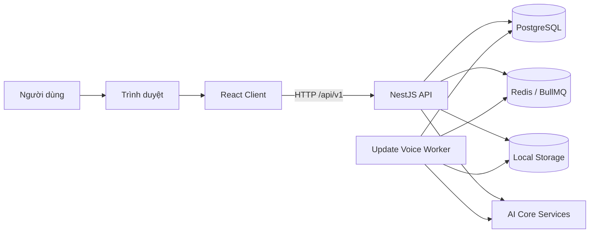

Trong development, Vite phục vụ frontend và proxy `/api`, `/cdn` tới backend.

Trong production, Nginx phục vụ frontend, tạo runtime config và proxy `/api/v1` tới backend.

## 2. Thành phần hệ thống

### 2.1. React Client

Trách nhiệm:

- Hiển thị giao diện và điều hướng.
- Bảo vệ route theo trạng thái đăng nhập và role.
- Quản lý access token và phiên người dùng.
- Gọi API và tự refresh token khi cần.
- Quản lý server state và client state.
- Upload, ghi âm, phát audio và hiển thị kết quả.

### 2.2. NestJS API

Trách nhiệm:

- Parse request, cookie và cấu hình CORS.
- Rate limit, xác thực và phân quyền.
- Validate DTO.
- Điều phối use-case.
- Truy vấn PostgreSQL.
- Quản lý file trong Storage.
- Gọi AI Core.
- Tạo job trong BullMQ.
- Chuẩn hóa response và log HTTP.

API prefix là `/api/v1`.

### 2.3. Update Voice Worker

Worker là tiến trình NestJS độc lập, không mở HTTP server.

Worker nhận job `update-voice` từ Redis/BullMQ, gọi AI Core, tạo phiên bản voice record mới và cập nhật trạng thái job.

Backend và worker dùng chung Docker image nhưng chạy entry point khác nhau.

### 2.4. PostgreSQL

PostgreSQL lưu dữ liệu nghiệp vụ lâu dài:

- Tài khoản và permission.
- Người được định danh.
- Metadata audio.
- Hồ sơ giọng nói.
- Phiên định danh.
- Job cập nhật.
- Lịch sử cập nhật và dịch.

Prisma là lớp truy cập dữ liệu và quản lý migration.

### 2.5. Redis/BullMQ

Redis phục vụ:

- Hàng đợi cập nhật giọng nói.
- Trạng thái tạm của job OCR, Speech-to-Text và dịch.
- Dữ liệu tạm có thời hạn.

Redis không thay thế PostgreSQL cho dữ liệu nghiệp vụ cần lưu lâu dài.

### 2.6. Local Storage

Storage hiện dùng local driver.

File nằm trên filesystem hoặc Docker volume. PostgreSQL chỉ lưu metadata và đường dẫn.

API cung cấp `/cdn` cho tài nguyên công khai và endpoint nghiệp vụ cho audio cần kiểm soát quyền.

### 2.7. AI Core

AI Core là tập hợp endpoint độc lập:

- Đăng ký và định danh giọng nói.
- OCR.
- Speech-to-Text.
- Lọc nhiễu.
- Dịch và tóm tắt.

Backend đóng vai trò adapter và điều phối. Repository này không chứa model AI.

## 3. Kiến trúc backend

Backend được tổ chức theo module nghiệp vụ và các lớp controller, use-case/service, repository và integration adapter.

Không phải module nào cũng có đầy đủ mọi lớp. Use-case có thể gọi repository, Prisma hoặc integration service tùy nghiệp vụ hiện tại.

### 3.1. Request lifecycle

Sơ đồ sau mô tả thứ tự xử lý HTTP request.

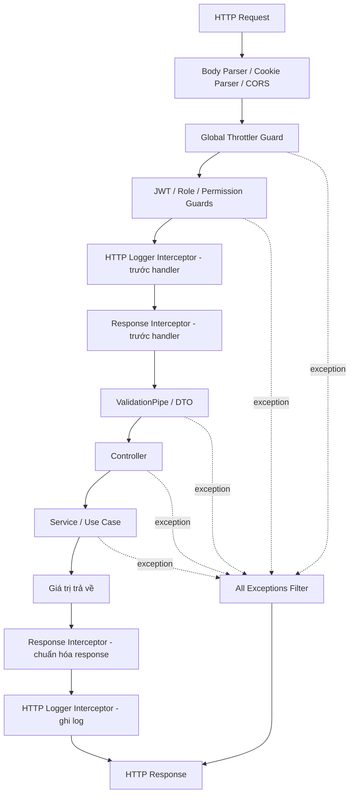

Interceptor bao quanh handler. Vì vậy mỗi interceptor có pha trước khi gọi handler và pha xử lý dữ liệu hoặc lỗi khi handler hoàn tất.

HTTP logger tạo request ID, ghi duration, status và metadata đã che một số field nhạy cảm.

Response interceptor chuyển kết quả thành response chuẩn. Exception filter ánh xạ exception sang error response.

### 3.2. Dependency architecture

Sơ đồ này mô tả quan hệ phụ thuộc, không phải thứ tự HTTP request.

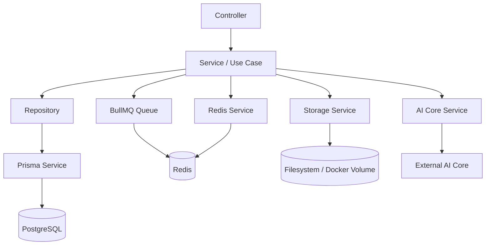

### 3.3. Trách nhiệm từng lớp

| Lớp                 | Trách nhiệm                                   |
| ------------------- | --------------------------------------------- |
| Controller          | Nhận request, khai báo Swagger, gọi nghiệp vụ |
| DTO/Validation      | Kiểm tra và chuyển đổi input                  |
| Service/Use Case    | Thực hiện nghiệp vụ và điều phối dependency   |
| Repository          | Đóng gói truy vấn dữ liệu                     |
| Prisma Service      | Kết nối và thực thi truy vấn PostgreSQL       |
| Integration Service | Gọi AI, Storage, Redis hoặc Queue             |
| Guard               | Kiểm tra JWT, role và permission              |
| Interceptor         | Log và chuẩn hóa success response             |
| Exception Filter    | Chuẩn hóa error response                      |

### 3.4. Các module backend

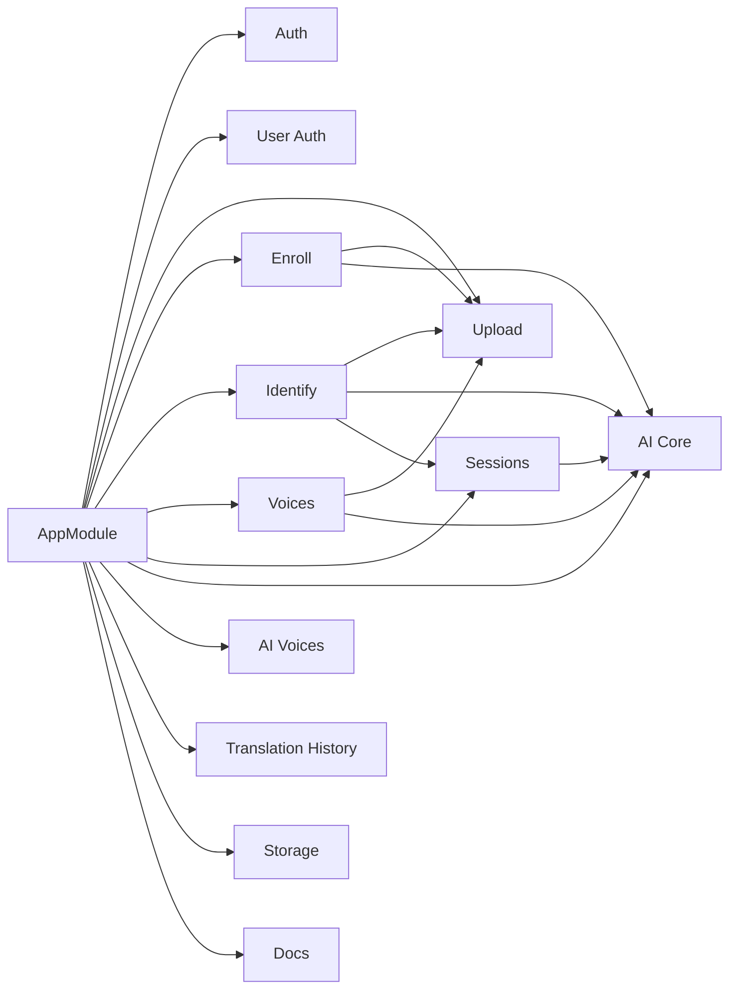

Prisma, Redis, logger, configuration, guards, interceptors và filter là hạ tầng dùng chung.

## 4. Kiến trúc worker

Worker active trong stack hiện tại xử lý queue `update-voice`.

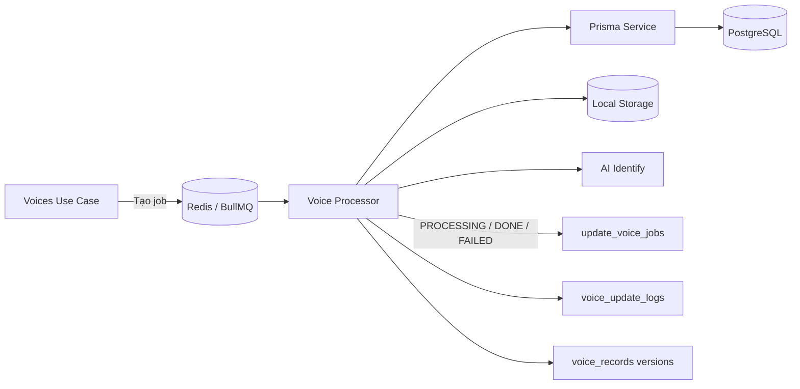

Luồng xử lý:

1. API kiểm tra hồ sơ và danh sách audio.
2. API tạo `update_voice_jobs` ở trạng thái `PENDING`.
3. API thêm job vào queue `update-voice`.
4. Worker chuyển job sang `PROCESSING`.
5. Worker tải từng audio lên AI Core.
6. Worker tạo voice record mới và vô hiệu hóa bản cũ.
7. Worker ghi audit log.
8. Worker đặt trạng thái `DONE` hoặc `FAILED`.

Source có email worker riêng, nhưng worker này không nằm trong `docker-compose.prod.yml` và không thuộc runtime chính hiện tại.

## 5. Kiến trúc frontend

Frontend dùng kiến trúc feature-based kết hợp routing, page/layout, feature module, API layer và các cơ chế quản lý state.

### 5.1. Sơ đồ frontend

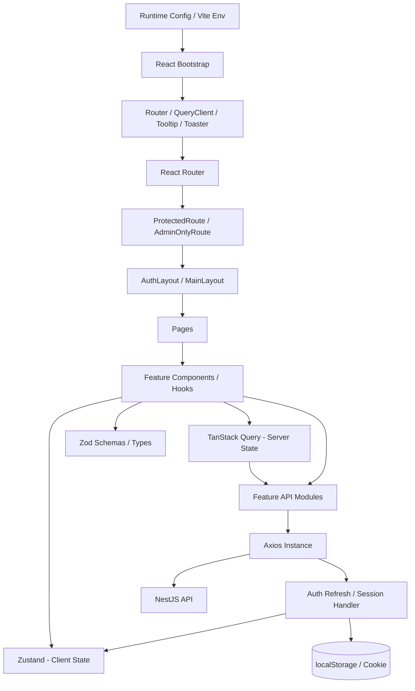

### 5.2. Bootstrap và provider

`main.tsx` khởi tạo:

- `BrowserRouter`.
- `QueryClientProvider`.
- `TooltipProvider`.
- `Toaster`.

Runtime config được ưu tiên hơn Vite build-time env để production đổi API base URL mà không cần build lại image.

### 5.3. Routing và authorization

`App.tsx` định nghĩa route và layout.

`ProtectedRoute` kiểm tra phiên đăng nhập. Nếu chưa có access token hợp lệ, component thử refresh token trước khi chuyển về trang login.

`AdminOnlyRoute` giới hạn route quản trị dựa trên role.

Route guard ở frontend chỉ phục vụ trải nghiệm người dùng. Backend vẫn phải kiểm tra JWT, role và permission cho mọi API được bảo vệ.

### 5.4. Page, layout và feature

Luồng render chính:

```text
Route → Route Guard → Layout → Page → Feature Component/Hook
```

Các feature hiện có:

| Feature           | Phạm vi                                 |
| ----------------- | --------------------------------------- |
| `admin-accounts`  | Quản trị tài khoản                      |
| `sessions`        | Lịch sử và chi tiết phiên               |
| `translate`       | OCR, Speech-to-Text, dịch và lịch sử    |
| `voice`           | Upload, enroll, identify và xử lý audio |
| `voice-directory` | Danh bạ và cập nhật hồ sơ giọng nói     |

Feature có thể chứa `api`, `components`, `hooks`, `schemas`, `store`, `types` và `utils`.

### 5.5. Quản lý state

Frontend phân biệt hai nhóm state:

| Công cụ        | Loại state                                                     |
| -------------- | -------------------------------------------------------------- |
| TanStack Query | Dữ liệu lấy từ backend, cache, loading và mutation             |
| Zustand        | Phiên đăng nhập, trạng thái ứng dụng và state nghiệp vụ cục bộ |
| React state    | State ngắn hạn trong component                                 |
| localStorage   | Access token và thông tin account hiện tại                     |
| Cookie         | Refresh token do backend quản lý                               |

TanStack Query mặc định retry query một lần, không retry mutation và dùng stale time năm phút.

### 5.6. API và session

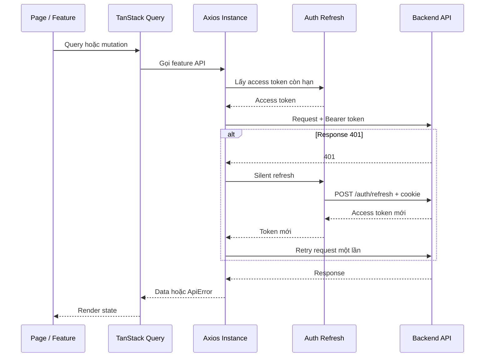

Nếu refresh thất bại, frontend xóa auth store, voice result và Query cache rồi chuyển người dùng về login.

### 5.7. Frontend deployment

Development:

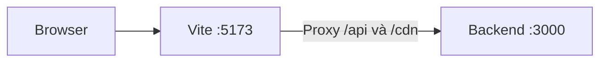

Production:

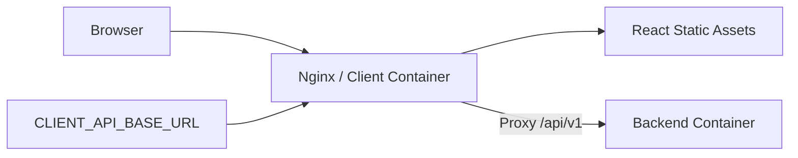

## 6. Triển khai development

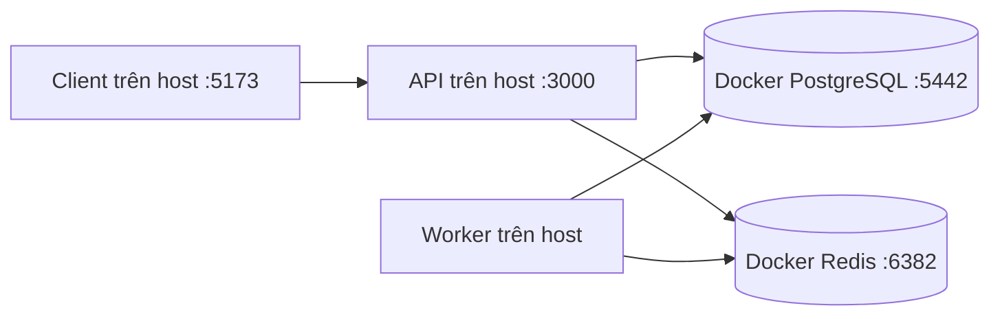

Development có thể chạy backend và worker trong Docker bằng `docker-compose.yml`.

## 7. Triển khai production

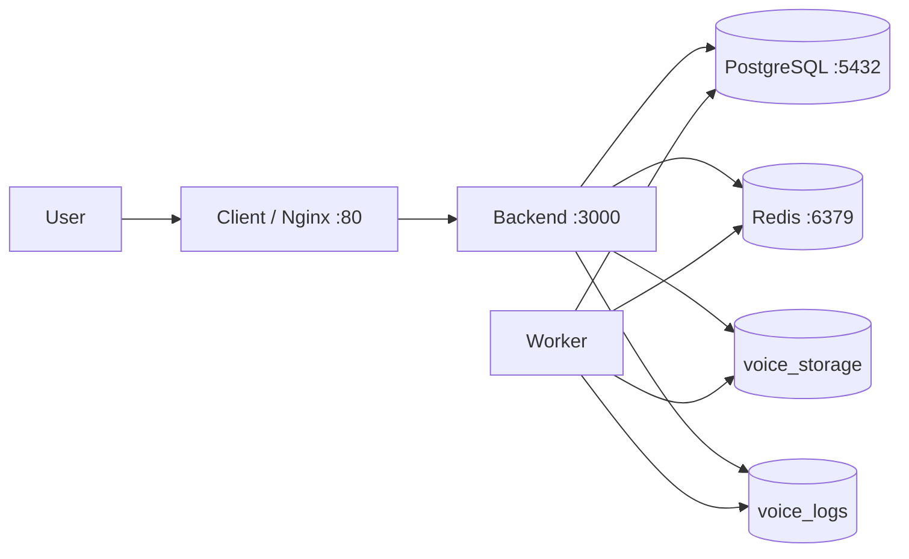

Các service giao tiếp trong Docker network. Chỉ client cần mở công khai trong mô hình proxy mặc định.

## 8. Luồng xác thực

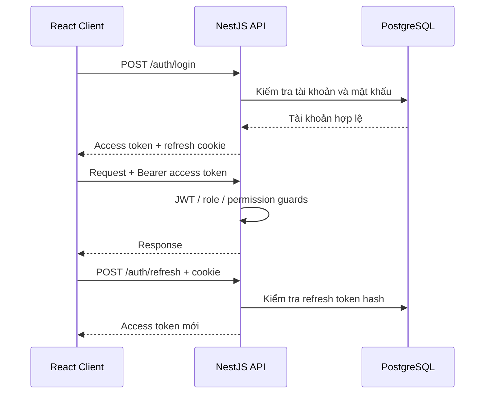

Access token hiện được lưu trong localStorage. Refresh token được backend đặt trong cookie.

## 9. Tính sẵn sàng và điểm lỗi

| Thành phần lỗi         | Ảnh hưởng                                 |
| ---------------------- | ----------------------------------------- |
| PostgreSQL             | Hầu hết API nghiệp vụ không hoạt động     |
| Redis                  | Queue và job tạm không hoạt động          |
| Worker                 | Job update voice nằm chờ                  |
| Storage                | Upload và xử lý audio thất bại            |
| AI Identify            | Enroll, identify và update voice thất bại |
| AI OCR/S2T/Translation | Chức năng AI tương ứng thất bại           |
| Backend                | Frontend không thực hiện được nghiệp vụ   |
| Nginx/Client           | Người dùng không truy cập được giao diện  |

Hệ thống hiện chưa có cơ chế high availability hoàn chỉnh trong repository.

## 10. Thành phần có source nhưng chưa thuộc runtime chính

### Google OAuth

Repository có biến môi trường Google OAuth nhưng chưa có controller, strategy hoặc dependency triển khai đăng nhập Google trong runtime hiện tại.

Google OAuth không được thể hiện trong sơ đồ runtime chính cho đến khi được triển khai.

### Email worker

Repository có source cho email worker và SMTP config.

Email worker chưa được import vào worker chính và không có service tương ứng trong `docker-compose.prod.yml`.

SMTP được xem là thành phần tùy chọn/chưa kích hoạt trong runtime hiện tại.

## 11. Quyết định và giới hạn hiện tại

- Monorepo dùng pnpm và Turborepo.
- Frontend tổ chức theo feature, không triển khai Clean Architecture đầy đủ.
- Backend tổ chức theo module và use-case/service.
- Storage chỉ hỗ trợ local driver.
- Backend và update-voice worker dùng chung image.
- Database là nguồn chuẩn của dữ liệu nghiệp vụ.
- Redis dùng cho queue và dữ liệu tạm.
- AI Core nằm ngoài repository.
- Monitoring nâng cao là optional.

## 12. Tài liệu liên quan

- [Luồng dữ liệu](data-flow.md)
- [ERD](erd.md)
- [Cấu trúc dự án](../technical/project-structure.md)
- [Yêu cầu hệ thống](../technical/system-requirements.md)
- [API tổng quan](../technical/api-overview.md)
- [Triển khai](../operations/deployment.md)
