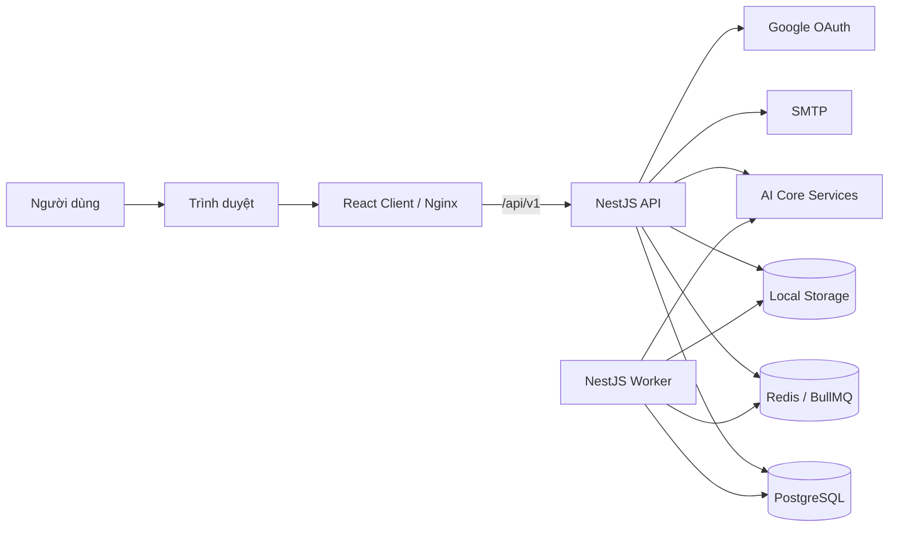
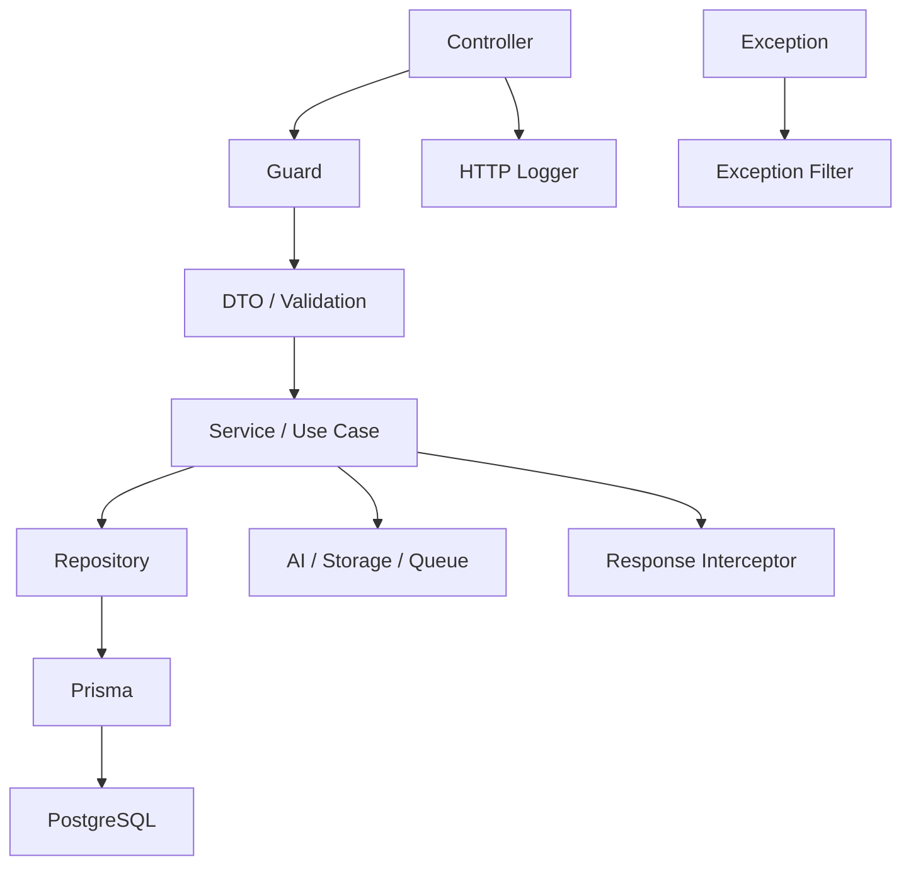
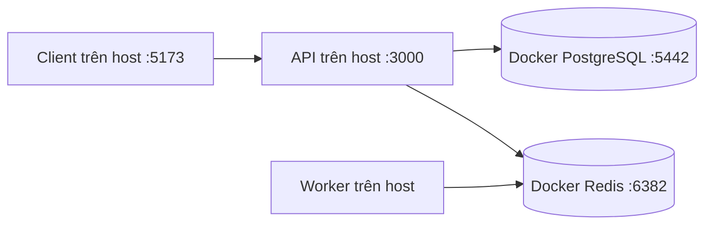
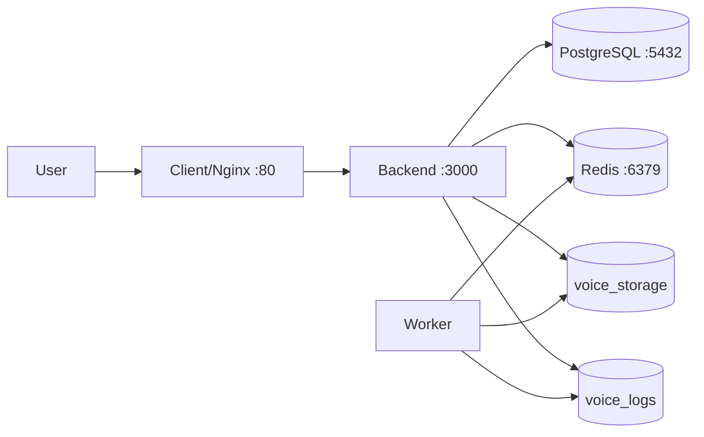
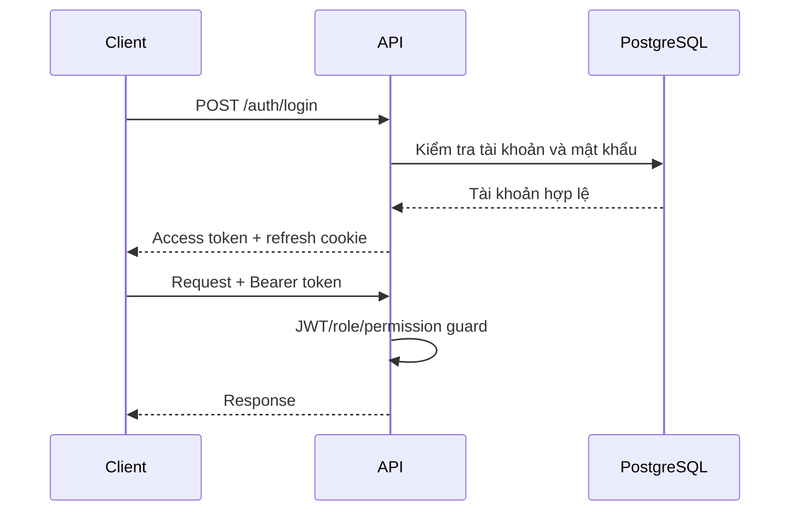

# Kiến trúc hệ thống

Tài liệu mô tả các thành phần, kết nối và ranh giới trách nhiệm của Hệ thống Định danh Giọng nói.

## 1. Tổng quan

Hệ thống sử dụng kiến trúc web ba lớp kết hợp worker bất đồng bộ.

## 2. Thành phần

### 2.1. Client

Client được xây dựng bằng React và Vite.

Trách nhiệm:

- Hiển thị giao diện.
- Quản lý trạng thái phiên đăng nhập.
- Gọi API.
- Upload, ghi và phát audio.
- Hiển thị kết quả định danh, transcript và lịch sử.

Development dùng Vite proxy. Production dùng Nginx phục vụ file tĩnh và proxy `/api/v1`.

### 2.2. API

API được xây dựng bằng NestJS.

Trách nhiệm:

- Xác thực và phân quyền.
- Validate request.
- Điều phối use-case.
- Lưu và truy vấn dữ liệu.
- Quản lý file.
- Gọi AI Core.
- Tạo job bất đồng bộ.
- Chuẩn hóa response và log HTTP.

API prefix là `/api/v1`.

### 2.3. Worker

Worker là tiến trình NestJS riêng, dùng chung code và Docker image với backend.

Trách nhiệm:

- Nhận job từ Redis/BullMQ.
- Xử lý audio bất đồng bộ.
- Gọi AI Core.
- Cập nhật tiến độ và trạng thái job.
- Ghi lịch sử thay đổi.

API có thể hoạt động khi worker dừng, nhưng các job nền sẽ không được xử lý.

### 2.4. PostgreSQL

PostgreSQL lưu dữ liệu nghiệp vụ lâu dài:

- Tài khoản và permission.
- Người được định danh.
- Metadata audio.
- Hồ sơ giọng nói.
- Phiên định danh.
- Job cập nhật.
- Lịch sử cập nhật và dịch.

Prisma là lớp truy cập dữ liệu và quản lý migration.

### 2.5. Redis/BullMQ

Redis phục vụ:

- Hàng đợi BullMQ.
- Trạng thái job AI.
- Dữ liệu tạm có thời hạn.

Redis không thay thế PostgreSQL cho dữ liệu nghiệp vụ cần lưu lâu dài.

### 2.6. Storage

Storage hiện dùng local driver.

File nằm trên filesystem hoặc Docker volume. PostgreSQL chỉ lưu metadata và đường dẫn.

API cung cấp đường dẫn `/cdn` cho tài nguyên công khai và endpoint nghiệp vụ cho audio cần kiểm soát quyền.

### 2.7. AI Core

AI Core là tập hợp các endpoint độc lập:

- Đăng ký/định danh giọng nói.
- OCR.
- Speech-to-Text.
- Lọc nhiễu.
- Dịch và tóm tắt.

Backend đóng vai trò adapter và điều phối. Repository này không chứa model AI.

## 3. Kiến trúc backend

### Controller

Nhận HTTP request, khai báo Swagger và gọi lớp nghiệp vụ.

### Use-case/service

Thực hiện quy tắc nghiệp vụ và điều phối dependency.

### Repository

Đóng gói truy vấn dữ liệu, chủ yếu qua Prisma.

### Guard

Kiểm tra JWT, role và permission trước khi vào handler.

### Interceptor/filter

Chuẩn hóa success response, error response, request ID và log.

## 4. Triển khai development

Development có thể chạy toàn bộ backend/worker trong Docker bằng `docker-compose.yml`.

## 5. Triển khai production

Các service giao tiếp trong Docker network. Chỉ client cần mở công khai trong mô hình proxy mặc định.

## 6. Luồng bảo mật

Refresh token được bảo vệ bằng chính sách cookie. Access token được gửi trong Authorization header.

## 7. Tính sẵn sàng và điểm lỗi

| Thành phần lỗi         | Ảnh hưởng                                                |
| ---------------------- | -------------------------------------------------------- |
| PostgreSQL             | Hầu hết API nghiệp vụ không hoạt động                    |
| Redis                  | Job bất đồng bộ dừng; một số API đồng bộ vẫn có thể chạy |
| Worker                 | Job nằm chờ trong queue                                  |
| Storage                | Upload và xử lý audio thất bại                           |
| AI Identify            | Enroll/identify/update voice thất bại                    |
| AI OCR/S2T/Translation | Chức năng AI tương ứng thất bại                          |
| SMTP                   | Gửi email thất bại                                       |

Hệ thống hiện chưa có cơ chế high availability hoàn chỉnh trong repository.

## 8. Quyết định và giới hạn hiện tại

- Monorepo dùng pnpm và Turborepo.
- Storage chỉ hỗ trợ local driver.
- Backend và worker dùng chung image.
- Database là nguồn chuẩn của dữ liệu nghiệp vụ.
- Redis dùng cho queue và dữ liệu tạm.
- AI Core nằm ngoài repository.
- Monitoring nâng cao là optional.

## 9. Tài liệu liên quan

- [Luồng dữ liệu](data-flow.md)
- [ERD](erd.md)
- [Yêu cầu hệ thống](../technical/system-requirements.md)
- [API tổng quan](../technical/api-overview.md)
- [Triển khai](../operations/deployment.md)
