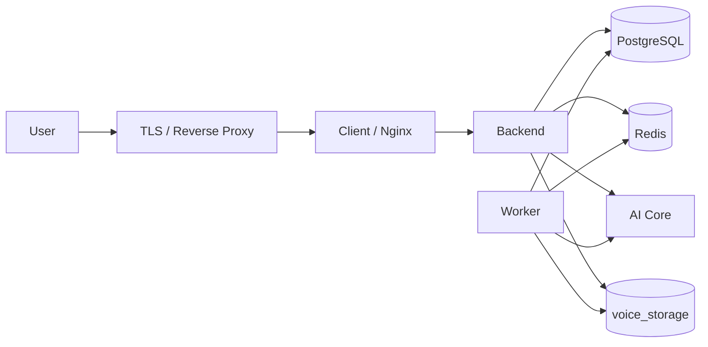

# Hướng dẫn triển khai

Tài liệu là runbook triển khai production bằng Docker Compose.

Luồng hiện tại là CI build và push image, sau đó người vận hành deploy thủ công trên server. Repository chưa tự động SSH hoặc triển khai lên server.

## 1. Phạm vi và mô hình triển khai

Production gồm:

- `client`: Nginx phục vụ React và proxy request.
- `backend`: NestJS HTTP API.
- `worker`: xử lý queue `update-voice`.
- `db`: PostgreSQL 15.
- `redis`: Redis và BullMQ.
- `migrate`: chạy Prisma migration theo profile `ops`.
- `prisma-studio`: công cụ tùy chọn theo profile `tools`.



Nginx trong image client lắng nghe HTTP port 80. HTTPS phải được terminate tại load balancer, ingress hoặc reverse proxy của hạ tầng.

AI Core nằm ngoài `docker-compose.prod.yml`. Server phải kết nối được tới từng endpoint AI đã cấu hình.

## 2. Tổng quan trình tự

Một lần triển khai production phải đi theo thứ tự:

1. Chọn phương thức release và image tag.
2. Chạy kiểm tra, build và push image.
3. Chuẩn bị server, DNS, TLS, firewall và volume.
4. Tạo và kiểm tra `.env.production`.
5. Kiểm tra Docker Compose và quyền pull image.
6. Backup dữ liệu nếu là nâng cấp.
7. Pull image.
8. Khởi động PostgreSQL và Redis.
9. Chạy migration.
10. Khởi động backend, worker và client.
11. Chạy smoke test.
12. Theo dõi log và chấp nhận hoặc rollback release.

Không bỏ qua bước backup, migration hoặc smoke test khi nâng cấp production.

## 3. Phương thức phát hành image

### 3.1. Phát hành bằng CI

Workflow `.github/workflows/ci.yml` chạy khi push hoặc tạo pull request vào `main` và `develop`.

CI hiện thực hiện:

- Phát hiện thay đổi backend/frontend.
- Cài dependency bằng lockfile.
- Sinh Prisma Client.
- Lint và build.
- Build image khi push vào `main`.
- Push image backend và frontend lên Docker Hub.

CI hiện tạo hai dạng tag:

```text
latest
sha-<short-commit>
```

Production phải dùng tag `sha-*` để truy vết. Không dùng riêng `latest` cho release cần rollback.

GitHub repository phải có:

```text
DOCKERHUB_USERNAME
DOCKERHUB_TOKEN
```

CI chưa chạy test tự động và chưa deploy lên server. Trước release phải chạy test liên quan hoặc bổ sung test vào quality gate của CI.

### 3.2. Phát hành thủ công

Khi không dùng CI, đặt image và tag trong `.env.production`, sau đó chạy:

```bash
make build
make push
```

Có thể build riêng:

```bash
make build-backend
make build-client
```

Tag thủ công có thể dùng version:

```env
IMAGE_TAG=v1.0.0
```

Không trộn tag CI `sha-*` và tag version thủ công nếu chưa xác định image nào là release chuẩn.

## 4. File cần có trên server

Server triển khai bằng image chỉ cần:

- `docker-compose.prod.yml`.
- `.env.production`.
- `Makefile`.
- Tài liệu runbook này.

Source code không bắt buộc có trên server nếu image đã được push lên registry.

Giữ file Compose và Makefile cùng version với release để tránh lệch command, volume hoặc biến môi trường.

## 5. Chuẩn bị server

### 5.1. Phần mềm

Server cần:

- Linux 64-bit.
- Docker Engine.
- Docker Compose v2.
- Quyền truy cập Docker registry.
- `curl` để kiểm tra HTTP.
- Đủ dung lượng cho image, database, audio, log và backup.

Xem cấu hình CPU, RAM và disk tại [Yêu cầu hệ thống](../technical/system-requirements.md).

### 5.2. Mạng và firewall

Phải cho phép:

- Người dùng truy cập port public của client hoặc reverse proxy.
- Backend và worker truy cập PostgreSQL, Redis và AI Core.
- Backend truy cập SMTP/OAuth nếu các chức năng này được bật.
- Server truy cập Docker Hub để pull image.

Không mở Redis ra Internet.

PostgreSQL và Prisma Studio chỉ được mở trong mạng tin cậy hoặc giới hạn bằng firewall.

### 5.3. DNS và HTTPS

Trước deploy phải chốt:

- Domain public.
- DNS record trỏ về server hoặc load balancer.
- Nơi terminate TLS.
- Chứng thư và quy trình gia hạn.
- Header `X-Forwarded-*` từ reverse proxy.

Khi dùng HTTPS, `COOKIE_SECURE` phải là `true`.

## 6. Chuẩn bị cấu hình production

### 6.1. Tạo file

```bash
cp .env.production.example .env.production
chmod 600 .env.production
```

Không commit `.env.production`.

### 6.2. Image

Với image do CI tạo:

```env
BACKEND_IMAGE=docker.io/<dockerhub-user>/identify-voice-backend
CLIENT_IMAGE=docker.io/<dockerhub-user>/identify-voice-client
IMAGE_TAG=sha-<short-commit>
```

Backend và frontend phải dùng tag thuộc cùng release.

### 6.3. Database và Redis

Phải thay các giá trị mẫu:

```env
DB_USER=<database-user>
DB_PASSWORD=<strong-database-password>
DB_NAME=voice_db
DB_SCHEMA=public
REDIS_PASSWORD=<strong-redis-password>
```

Compose tự dựng `DATABASE_URL` và `REDIS_URL` nội bộ cho backend, worker và migrate.

### 6.4. Storage

Production Compose mount volume:

```text
voice_storage:/app/storage
```

Vì vậy phải đặt:

```env
STORAGE_ROOT_DIR=/app/storage
```

Nếu dùng `./storage`, file sẽ nằm trong filesystem của container thay vì volume `voice_storage`.

`STORAGE_CDN_URL` phải là URL public đi qua client/reverse proxy:

```env
STORAGE_CDN_URL=https://<domain>/cdn
```

### 6.5. Domain, cookie và CORS

Kiểm tra:

- `BACKEND_URL`.
- `STORAGE_CDN_URL`.
- `CORS_ORIGINS`.
- `COOKIE_DOMAIN`.
- `GOOGLE_REDIRECT_URI` nếu dùng OAuth.

Không để `your-domain.example` trong file chạy thật.

Production HTTPS:

```env
COOKIE_SECURE=true
COOKIE_HTTP_ONLY=true
```

### 6.6. AI Core

Phải cấu hình đúng các endpoint:

- `AI_CORE_IDENTIFY_URL`.
- `AI_CORE_OCR_URL`.
- `AI_CORE_SPEECH_TO_TEXT_URL`.
- `AI_CORE_FILTER_NOISE_URL`.
- `AI_CORE_TRANSLATION_URL`.

Không dùng `localhost` nếu AI Core chạy trên máy hoặc container khác. Trong container, `localhost` luôn trỏ về chính container đó.

### 6.7. Secret

Phải thay:

- `JWT_ACCESS_SECRET`.
- `JWT_REFRESH_SECRET`.
- `JWT_SECRET`.
- Database password.
- Redis password.
- SMTP credential nếu dùng.
- Google OAuth secret nếu dùng.

Nên tạo JWT secret bằng công cụ sinh chuỗi ngẫu nhiên của hệ thống quản lý secret.

## 7. Kiểm tra trước khi deploy

### 7.1. Tìm placeholder

```bash
grep -En \
  'replace-|your-domain|your-dockerhub-user|sha-0123456' \
  .env.production
```

Kết quả phải rỗng.

### 7.2. Kiểm tra Docker Compose

```bash
docker compose \
  -f docker-compose.prod.yml \
  --env-file .env.production \
  config --quiet
```

Không đưa output đầy đủ của `docker compose config` vào ticket hoặc log công khai vì có thể chứa secret đã resolve.

### 7.3. Đăng nhập registry

```bash
docker login
```

Tài khoản phải có quyền pull cả image backend và frontend.

### 7.4. Kiểm tra kết nối ngoài

Từ server, kiểm tra:

- DNS và HTTPS của AI Core.
- SMTP/OAuth nếu được bật.
- Registry.
- Domain public và chứng thư TLS.

Không tiếp tục deploy nếu endpoint bắt buộc chưa truy cập được.

## 8. Backup trước khi nâng cấp

Lần triển khai đầu tiên không có dữ liệu cũ để backup.

Mọi lần nâng cấp có migration phải backup PostgreSQL trước.

Tạo thư mục backup:

```bash
mkdir -p backups
backup_timestamp="$(date +%Y%m%d-%H%M%S)"
```

Ví dụ tạo custom-format dump từ container:

```bash
docker compose \
  -f docker-compose.prod.yml \
  --env-file .env.production \
  exec -T db \
  sh -c 'pg_dump -U "$POSTGRES_USER" -d "$POSTGRES_DB" -Fc' \
  > "backups/postgres-${backup_timestamp}.dump"
```

Phải kiểm tra file backup có kích thước hợp lý và sao chép ra vị trí ngoài server.

Repository chưa tự động hóa backup, retention, encryption hoặc restore test. Bên vận hành phải chốt chính sách trước production.

## 9. Triển khai lần đầu

### Bước 1: Pull image

```bash
make pull
```

Kiểm tra image tag:

```bash
docker compose \
  -f docker-compose.prod.yml \
  --env-file .env.production \
  images
```

### Bước 2: Khởi động PostgreSQL và Redis

```bash
docker compose \
  -f docker-compose.prod.yml \
  --env-file .env.production \
  up -d db redis
```

Kiểm tra:

```bash
docker compose \
  -f docker-compose.prod.yml \
  --env-file .env.production \
  ps
```

Chỉ chạy migration khi PostgreSQL và Redis đã healthy.

### Bước 3: Chạy migration

```bash
make migrate
```

Nếu migration thất bại, dừng triển khai và kiểm tra log. Không khởi động release mới trên schema chưa hoàn tất.

### Bước 4: Khởi động ứng dụng

```bash
make up
```

Stack phải có:

- `backend`.
- `worker`.
- `client`.
- `db`.
- `redis`.

### Bước 5: Kiểm tra trạng thái và log

```bash
make ps
```

```bash
docker compose \
  -f docker-compose.prod.yml \
  --env-file .env.production \
  logs --tail=100 backend worker client
```

Không tiếp tục nghiệm thu nếu container restart liên tục hoặc có lỗi kết nối lặp lại.

## 10. Smoke test sau deploy

Thực hiện theo thứ tự:

1. Mở frontend.
2. Kiểm tra backend qua `/api/v1`.
3. Đăng nhập.
4. Kiểm tra refresh token.
5. Upload audio mẫu.
6. Enroll một hồ sơ test.
7. Identify single và multi.
8. Tạo một Update Voice job và kiểm tra worker.
9. Mở audio URL qua `/cdn`.
10. Kiểm tra session và translation history.

Checklist:

- [ ] Frontend tải được và không lỗi asset.
- [ ] API trả response qua Nginx.
- [ ] Login và refresh token hoạt động.
- [ ] Cookie có domain, secure và SameSite phù hợp.
- [ ] Swagger chỉ mở theo chính sách môi trường.
- [ ] Upload, Enroll và Identify thành công.
- [ ] Worker xử lý job đến `DONE` hoặc trả lỗi có ý nghĩa.
- [ ] Audio URL phát được.
- [ ] PostgreSQL, Redis và AI Core không có lỗi kết nối lặp lại.
- [ ] Log không chứa secret hoặc dữ liệu nhạy cảm.

Backend chưa có health endpoint chuyên dụng. Không dùng `/health` làm acceptance gate cho đến khi endpoint được triển khai.

## 11. Tiêu chí chấp nhận release

Chấp nhận release khi:

- Tất cả container cần thiết ổn định.
- Migration hoàn tất.
- Smoke test bắt buộc đạt.
- Worker nhận được job.
- Không có lỗi 5xx hoặc lỗi kết nối lặp lại.
- Image tag và thời điểm deploy đã được ghi lại.

Rollback khi:

- Backend, worker hoặc client không thể khởi động ổn định.
- Migration làm ứng dụng không hoạt động.
- Login hoặc nghiệp vụ chính bị lỗi nghiêm trọng.
- Có nguy cơ mất dữ liệu.

## 12. Nâng cấp phiên bản

### 12.1. Chuẩn bị

1. Đọc release note và migration.
2. Xác định migration có tương thích ngược không.
3. Ghi lại `IMAGE_TAG` đang chạy.
4. Backup PostgreSQL.
5. Cập nhật `IMAGE_TAG` mới.
6. Chạy kiểm tra tại phần 7.

### 12.2. Migration tương thích ngược

Nếu schema mới vẫn chạy được với image cũ:

```bash
make pull
make migrate
make up
make ps
```

Sau đó chạy smoke test và theo dõi log.

### 12.3. Migration không tương thích ngược

Phải lập kế hoạch downtime và rollback dữ liệu riêng.

Trình tự tối thiểu:

1. Bật maintenance mode tại reverse proxy.
2. Dừng `client`, `backend` và `worker`.
3. Chạy migration.
4. Khởi động release mới.
5. Chạy smoke test.
6. Tắt maintenance mode khi đạt.

Không chạy migration phá vỡ schema trong khi image cũ vẫn xử lý request.

## 13. Rollback

### 13.1. Rollback image

Nếu migration tương thích ngược:

1. Đặt `IMAGE_TAG` về tag trước.
2. Pull image cũ.
3. Khởi động lại stack.
4. Chạy smoke test.

```bash
make pull
make up
make ps
```

### 13.2. Rollback database

Prisma không tự động rollback migration production.

Chỉ restore backup khi đã:

- Dừng request ghi dữ liệu.
- Xác định dữ liệu phát sinh sau backup có thể bị mất.
- Có phê duyệt của người chịu trách nhiệm.
- Kiểm tra đúng database và đúng file backup.

Không chạy `migrate reset`, `db push` hoặc xóa volume để rollback production.

## 14. Volume và dữ liệu

| Volume               | Dữ liệu    | Yêu cầu backup          |
| -------------------- | ---------- | ----------------------- |
| `postgres_prod_data` | PostgreSQL | Bắt buộc                |
| `voice_storage`      | Audio/file | Theo chính sách dữ liệu |
| `voice_logs`         | Log        | Theo retention          |

`docker compose down` không xóa volume nếu không có `-v`.

Không dùng `down -v` trên môi trường có dữ liệu cần giữ.

Storage và PostgreSQL phải được backup theo cùng mốc nghiệp vụ khi cần khôi phục nhất quán.

## 15. Log và theo dõi sau deploy

Xem log toàn stack:

```bash
make logs
```

Xem riêng:

```bash
docker compose \
  -f docker-compose.prod.yml \
  --env-file .env.production \
  logs -f backend worker
```

Backend ghi:

- `http-YYYY-MM-DD.log`.
- `error-YYYY-MM-DD.log`.
- `combined-YYYY-MM-DD.log`.

Log được mount vào volume `voice_logs`.

Monitoring và metrics chưa được triển khai thực tế. Các biến Prometheus/health trong template chỉ là cấu hình dự phòng.

## 16. Dừng và khởi động lại

Dừng stack:

```bash
make down
```

Khởi động:

```bash
make up
```

Restart container hiện tại:

```bash
make restart
```

`make restart` không pull image mới và không chạy migration.

## 17. Prisma Studio

Prisma Studio là công cụ tùy chọn, không thuộc luồng deploy chính.

Khởi động:

```bash
make tools-up
```

Mặc định:

```text
http://localhost:5555
```

Tắt:

```bash
make tools-down
```

Chỉ bật tạm trong mạng tin cậy. Không công khai Prisma Studio ra Internet.

## 18. Troubleshooting nhanh

| Triệu chứng                | Kiểm tra đầu tiên                       |
| -------------------------- | --------------------------------------- |
| Không pull được image      | Registry login, image name và tag       |
| Compose config lỗi         | Placeholder và biến trong env           |
| Container restart liên tục | `docker compose logs <service>`         |
| Migration fail             | `prisma migrate status`, `DATABASE_URL` |
| Client trả 502             | Backend status và `BACKEND_UPSTREAM`    |
| Login không giữ phiên      | Cookie domain, HTTPS và CORS            |
| Audio mất sau restart      | `STORAGE_ROOT_DIR` và `voice_storage`   |
| Worker không chạy job      | Redis, worker log và queue              |
| AI timeout                 | URL, firewall, DNS và AI log            |

Chi tiết xem [Troubleshooting](troubleshooting.md).

## 19. Thông tin cần ghi lại sau deploy

- Môi trường.
- Commit hoặc release version.
- Image tag backend/frontend.
- Người thực hiện.
- Thời gian bắt đầu và kết thúc.
- Migration đã chạy.
- Vị trí backup.
- Kết quả smoke test.
- Sự cố và cách xử lý.
- Quyết định accept hoặc rollback.

## 20. Giới hạn hiện tại

- CI chưa chạy test và chưa tự động deploy lên server.
- Chưa có health endpoint chuyên dụng.
- Chưa có script backup/restore chuẩn.
- Chưa có maintenance mode trong repository.
- Chưa có zero-downtime deployment.
- Monitoring/metrics chưa được triển khai.
- AI Core không nằm trong Compose production.

Các giới hạn phải được tính vào kế hoạch vận hành và SLA.

## 21. Tài liệu liên quan

- [Yêu cầu hệ thống](../technical/system-requirements.md)
- [Cài đặt môi trường](../setup/environment-setup.md)
- [Build và chạy](../setup/build-and-run.md)
- [Kiến trúc hệ thống](../architecture/system-architecture.md)
- [Troubleshooting](troubleshooting.md)
