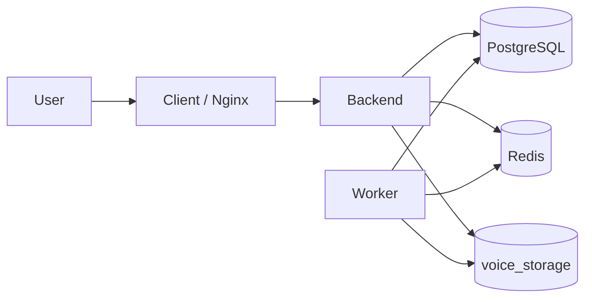

# Hướng dẫn triển khai

Tài liệu mô tả quy trình build image, chuẩn bị máy chạy và triển khai production bằng Docker Compose.

## 1. Mô hình triển khai

Production gồm:

- `client`: Nginx phục vụ React và proxy API.
- `backend`: NestJS API.
- `worker`: xử lý job nền, dùng chung image backend.
- `db`: PostgreSQL 15.
- `redis`: Redis/BullMQ.
- `migrate`: service chạy Prisma migration theo profile `ops`.
- `prisma-studio`: công cụ tùy chọn theo profile `tools`.



## 2. File cần có trên máy chạy

- `docker-compose.prod.yml`.
- `.env.production`.
- `Makefile`.
- Tài liệu triển khai này.

Máy chạy không bắt buộc có source nếu chỉ pull image từ registry.

## 3. Chuẩn bị image

### 3.1. Chọn tag

Dùng version hoặc commit SHA:

```env
IMAGE_TAG=v1.0.0
```

Không dùng riêng `latest` cho bản phát hành cần truy vết.

### 3.2. Build bằng Makefile

```bash
make build
```

Hoặc build riêng:

```bash
make build-backend
make build-client
```

### 3.3. Push lên registry

```bash
make push
```

Các biến cần đặt:

```env
BACKEND_IMAGE=<registry>/<project>/identify-voice-backend
CLIENT_IMAGE=<registry>/<project>/identify-voice-client
IMAGE_TAG=<version-or-sha>
```

## 4. Chuẩn bị cấu hình production

```bash
cp .env.production.example .env.production
```

Phải thay toàn bộ placeholder và secret mẫu.

### 4.1. Image và runtime

```env
BACKEND_IMAGE=<backend-image>
CLIENT_IMAGE=<client-image>
IMAGE_TAG=<immutable-tag>
PORT=3000
CLIENT_PORT=8080
CLIENT_API_BASE_URL=/api/v1
```

### 4.2. Database và Redis

```env
DB_USER=<db-user>
DB_PASSWORD=<strong-password>
DB_NAME=voice_db
DB_SCHEMA=public
REDIS_PASSWORD=<strong-password>
```

Compose tự dựng `DATABASE_URL` và `REDIS_URL` nội bộ cho backend/worker.

### 4.3. Domain và URL

Phải kiểm tra:

- `BACKEND_URL`.
- `STORAGE_CDN_URL`.
- Các `AI_CORE_*_URL`.
- `CORS_ORIGINS`.
- `COOKIE_DOMAIN`.
- `GOOGLE_REDIRECT_URI`.

Không để domain `example.com` trong bản production.

### 4.4. Security

Phải thay:

- `JWT_ACCESS_SECRET`.
- `JWT_REFRESH_SECRET`.
- `JWT_SECRET` nếu còn được sử dụng.
- SMTP credential.
- Google OAuth secret.
- Database password.
- Redis password.

Production qua HTTPS phải dùng:

```env
COOKIE_SECURE=true
COOKIE_HTTP_ONLY=true
```

## 5. Chuẩn bị máy chạy

1. Cài Docker Engine và Docker Compose v2.
2. Đăng nhập registry.
3. Chuẩn bị firewall.
4. Tạo file `.env.production`.
5. Kiểm tra dung lượng đĩa.
6. Kiểm tra kết nối tới AI Core, SMTP và OAuth.
7. Chuẩn bị backup database hiện tại nếu nâng cấp.

Không mở Redis ra Internet.

PostgreSQL và Prisma Studio chỉ được mở trong mạng tin cậy khi thật sự cần.

## 6. Triển khai lần đầu

### Bước 1: Pull image

```bash
make pull
```

### Bước 2: Khởi động database và Redis

```bash
docker compose \
  -f docker-compose.prod.yml \
  --env-file .env.production \
  up -d db redis
```

### Bước 3: Chạy migration

```bash
make migrate
```

### Bước 4: Khởi động stack

```bash
make up
```

### Bước 5: Kiểm tra

```bash
make ps
make logs
```

## 7. Nâng cấp phiên bản

1. Đọc release note và migration.
2. Backup database.
3. Cập nhật `IMAGE_TAG`.
4. Pull image mới.
5. Chạy migration.
6. Khởi động lại stack.
7. Smoke test.
8. Theo dõi log.

Lệnh:

```bash
make pull
make migrate
make up
make ps
```

## 8. Smoke test sau deploy

- [ ] Trang frontend tải được.
- [ ] Login hoạt động.
- [ ] Refresh token hoạt động.
- [ ] Swagger chỉ mở theo chính sách môi trường.
- [ ] Upload audio mẫu thành công.
- [ ] Enroll test thành công.
- [ ] Identify single/multi test thành công.
- [ ] Worker nhận và hoàn thành job.
- [ ] Audio URL phát được từ trình duyệt.
- [ ] Lịch sử session và translation truy vấn được.
- [ ] Log không có lỗi kết nối lặp lại.

## 9. Volume và dữ liệu

| Volume               | Dữ liệu    | Backup                  |
| -------------------- | ---------- | ----------------------- |
| `postgres_prod_data` | PostgreSQL | Bắt buộc                |
| `voice_storage`      | Audio/file | Theo chính sách dữ liệu |
| `voice_logs`         | Log        | Tùy retention           |

`docker compose down` không xóa volume nếu không có `-v`.

Không dùng `down -v` trên môi trường có dữ liệu cần giữ.

## 10. Backup và restore

Repository chưa cung cấp script backup/restore chuẩn.

Trước production phải chốt:

- Lịch backup.
- Retention.
- Mã hóa backup.
- Vị trí lưu ngoài máy chạy.
- Quy trình restore.
- Kiểm thử restore định kỳ.

Tối thiểu phải backup PostgreSQL trước mỗi migration production.

## 11. Prisma Studio

Khởi động:

```bash
make tools-up
```

Mặc định:

```text
http://localhost:5555
```

Tắt:

```bash
make tools-down
```

Chỉ bật tạm trong mạng tin cậy. Không công khai Prisma Studio ra Internet.

## 12. Log

Xem log Compose:

```bash
make logs
```

Xem riêng:

```bash
docker compose \
  -f docker-compose.prod.yml \
  --env-file .env.production \
  logs -f backend
```

Backend ghi log HTTP, error và combined vào volume `voice_logs`.

## 13. Rollback

Rollback image:

1. Đặt lại `IMAGE_TAG` về bản trước.
2. Pull image.
3. Khởi động lại stack.

Không tự động rollback migration database.

Nếu release có migration không tương thích ngược, phải có kế hoạch rollback dữ liệu riêng trước khi deploy.

## 14. Dừng và khởi động lại

Dừng:

```bash
make down
```

Khởi động:

```bash
make up
```

Restart service:

```bash
make restart
```

## 15. Troubleshooting deploy

| Triệu chứng                | Kiểm tra đầu tiên                       |
| -------------------------- | --------------------------------------- |
| Container restart liên tục | `docker compose logs <service>`         |
| Migration fail             | `prisma migrate status`, `DATABASE_URL` |
| Client 502                 | Backend status và `BACKEND_UPSTREAM`    |
| Login không giữ phiên      | Cookie domain, HTTPS, CORS              |
| Audio không mở             | `STORAGE_CDN_URL`, volume, quyền file   |
| Worker không chạy job      | Redis, worker log, queue                |
| AI timeout                 | URL, firewall, DNS, AI log              |

Chi tiết xem [Troubleshooting](troubleshooting.md).

## 16. Tài liệu liên quan

- [Yêu cầu hệ thống](../technical/system-requirements.md)
- [Cài đặt môi trường](../setup/environment-setup.md)
- [Build và chạy](../setup/build-and-run.md)
- [Kiến trúc hệ thống](../architecture/system-architecture.md)
